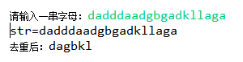

# 第1题 

ArrayList有以下元素: `"a","f","b","c","a","d"`，利用HashSet对ArrayList集合去重(最终结果: ArrayList中没有重复元素)

答：

~~~java
public class Test1 {
    public static void main(String[] args) {
        List<String> list = new ArrayList<>();
        list.add("a");
        list.add("f");
        list.add("b");
        list.add("c");
        list.add("a");
        list.add("d");

        Set<String> set = new HashSet<String>();
        set.addAll(list);
        list.clear();
        list.addAll(set);

        list.forEach(li -> System.out.println(li));
    }
}

~~~

# 第2题

**自定义学生类:包含姓名,年龄,成绩属性.私有成员变量,生成无参,有参构造方法,生成get/set方法.创建5个学生放到ArrayList中.使用迭代器获取每个学生信息.统计总分,平均分,最高分,最低分并输出**

**步骤说明**

1. 定义学生类生成类无参,有参构造方法,生成get/set方法.
2. 定义ArrayList
3. 添加5个学生
4. 获取迭代器
5. 定义总分
6. 定义最高分
7. 定义最低分
8. 循环判断是否有下一个学生
9. 使用next方法获取学生对象
10. 将这个学生对象的分数添加到总分
11. 判断这个学生的分数是否大于最大分数
12. 这个学生的分数大于最大分数.最大分数等于这个学生的分数
13. 判断这个学生的分数是否低于最大分数
14. 这个学生的分数小于最小分数.最小分数等于这个学生的分数
15. 计算平均分(平均分 = 总分/人数)
16. 打印总分,最高分,最低分
17. 

答：

~~~java
public class Test2 {
    public static void main(String[] args) {
        List<Student> list = new ArrayList<>();
        list.add(new Student("张三", 18, 85));
        list.add(new Student("李四", 19, 75));
        list.add(new Student("王五", 18, 69));
        list.add(new Student("马六", 20, 98));
        list.add(new Student("钱七", 18, 46));

        Iterator<Student> iterator = list.iterator();
        int total = 0;
        int max = -1;
        int min = 101;

        Student stu;
        while (iterator.hasNext()) {
            stu = iterator.next();
            total += stu.getScore();
            if (stu.getScore() > max) {
                max = stu.getScore();
            } else {
                if (stu.getScore() < min) {
                    min = stu.getScore();
                }
            }
        }

        System.out.println("总分：" + total + "\n最高分：" + max + "\n最低分：" + min + "\n平均分：" + total / list.size());

    }
}

class Student {
    private String name;
    private int age;
    private int score;

    public Student() {
    }

    public Student(String name, int age, int score) {
        this.name = name;
        this.age = age;
        this.score = score;
    }

    public String getName() {
        return name;
    }

    public void setName(String name) {
        this.name = name;
    }

    public int getAge() {
        return age;
    }

    public void setAge(int age) {
        this.age = age;
    }

    public int getScore() {
        return score;
    }

    public void setScore(int score) {
        this.score = score;
    }

    @Override
    public String toString() {
        return "Student{" +
                "name='" + name + '\'' +
                ", age=" + age +
                ", score=" + score +
                '}';
    }
}
~~~

# 第3题

自定义人类:包含姓名,年龄,身高属性.私有成员变量,生成无参,有参构造方法,生成get/set方法.创建5个人放到**
**ArrayList中.使用迭代器获取每个人的信息.找出最高的人,最矮的人并输出最高人和最矮人的信息.**

**打印格式如下:最高的人是张三,身高1.80. 最矮的人是李四,身高1.60**

**步骤说明**

1. 定义学人类生成类无参,有参构造方法,生成get/set方法
2. 定义ArrayList
3. 添加5个学生
4. 获取迭代器
5. 定义最高人
6. 定义最矮人
7. 使用迭代器循环判断是否有下一个人
8. 使用next方法获取学生对象
9. 判断这个人的的身高是否大于最大高度
10. 这个人的的身高大于最大高度.最大身高的人等于这个人
11. 判断这个人的的身高是否小于于最矮高度
12. 这个人的的身高小于于最矮高度.最矮身高的人等于这个人
13. 按照格式打印信息

答：

~~~java
public class Test3 {
    public static void main(String[] args) {
        List<People> list = new ArrayList<>();
        list.add(new People("张三", 20, 1.80));
        list.add(new People("李四", 20, 1.60));
        list.add(new People("王五", 20, 1.65));
        list.add(new People("马六", 20, 1.75));
        list.add(new People("钱七", 20, 1.72));

        Iterator<People> i = list.iterator();
        People p;
        People tollerp = new People("", 20, 0.00);
        People lowerp = new People("", 20, 3.00);

        while (i.hasNext()) {
            p = i.next();
            if (p.getHeight() > tollerp.getHeight()) {
                tollerp = p;
            } else {
                if (p.getHeight() < lowerp.getHeight()) {
                    lowerp = p;
                }
            }
        }

        System.out.println("最高的人是" + tollerp.getName() + ",身高" + tollerp.getHeight() + ".最矮的人是" + lowerp.getName() + ",身高" + lowerp.getHeight());
    }
}

class People {
    private String name;
    private int age;
    private double height;

    public People() {
    }

    public People(String name, int age, double height) {
        this.name = name;
        this.age = age;
        this.height = height;
    }

    public String getName() {
        return name;
    }

    public void setName(String name) {
        this.name = name;
    }

    public int getAge() {
        return age;
    }

    public void setAge(int age) {
        this.age = age;
    }

    public double getHeight() {
        return height;
    }

    public void setHeight(double height) {
        this.height = height;
    }

    @Override
    public String toString() {
        return "People{" +
                "name='" + name + '\'' +
                ", age=" + age +
                ", height=" + height +
                '}';
    }
}
~~~

# 第4题

实现ArrayList扩容的代码及添加注释描述

答：

~~~java
 //扩容机制，返回的是扩容后的长度
    private int newCapacity(int minCapacity) {  //minCapacity=size+1
        // overflow-conscious code
        int oldCapacity = elementData.length;
        int newCapacity = oldCapacity + (oldCapacity >> 1); //新长度等于旧长度的1.5倍
        if (newCapacity - minCapacity <= 0) {   //如果出现新长度小于等于旧长度
            if (elementData == DEFAULTCAPACITY_EMPTY_ELEMENTDATA)   //1.此时数组是空的
                return Math.max(DEFAULT_CAPACITY, minCapacity);     //返回数组初始默认长度10和minCapacity中的最大值
            if (minCapacity < 0) //2.数值溢出，抛内存泄漏异常
                throw new OutOfMemoryError();
            return minCapacity; //新长度根据扩容机制会出现溢出，返回minCapacity使数组长度加1来存储新元素
        }
        return (newCapacity - MAX_ARRAY_SIZE <= 0)  //新长度未超出int值的最大值-8时返回新长度，否则在MinCapacity未溢出的情况下，如果MinCapacity大于int类型的最大值-8，返回int类型的最大值，否则返回int类型最大值-8
                ? newCapacity
                : hugeCapacity(minCapacity);
    }
~~~

# 第5题

实现ArrayList的remove方法及添加注释描述

答：

~~~java
public E remove(int index) {
        Objects.checkIndex(index, size);    //判断index是否合法
        final Object[] es = elementData;    //两个指向的都是同一个数组

        @SuppressWarnings("unchecked") E oldValue = (E) es[index];  //存储要移除的值
        fastRemove(es, index);  //移除index上的元素，并将后面的元素全部前移一位，

        return oldValue;    //返回移除的值
    }
~~~

# 第6题

实现ArrayList的add方法及添加注释描述

答：

~~~java
public boolean add(E e) {
        modCount++;                 //记录集合修改的次数，每次修改都加一
        add(e, elementData, size);  //将元素添加到数组中，但需要先判断是否需要扩容，不扩容直接添加进入集合。
        return true;
    }
~~~

# 第7题

案例：键盘录入一个字符串，去掉其中重复字符，打印出不同的那些字符，必须保证顺序。例如输入：aaaabbbcccddd，打印结果为：abcd。效果如图：

提示：LinkedHashSet的使用

~~~java
public static void main(String[] args) {
        String str = "dadddaadgbgadkllaga";

        char[] c = str.toCharArray();
        Set<Character> set = new LinkedHashSet<Character>();
        for (int i = 0; i < c.length; i++) {
            set.add(c[i]);
        }

        set.forEach(li -> System.out.print(li));
    }
~~~

