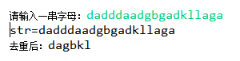

# 第1题 

ArrayList有以下元素: `"a","f","b","c","a","d"`，利用HashSet对ArrayList集合去重(最终结果: ArrayList中没有重复元素)

~~~ java
package homework;

import java.util.ArrayList;
import java.util.HashSet;

/**
 *
 */
public class test09 {
    public static void main(String[] args){
        ArrayList<String> lists = new ArrayList<>();
        lists.addAll(list,"a","f","b","c","a","d");
     
        HashSet<String> sets = new HashSet<>();
        sets.addAll(lists);
        System.out.println("HashSet:"+sets);
        lists.clear();
        System.out.println("lists:"+lists);
        lists.addAll(sets);
        System.out.println("lists:"+lists);

    }
}
~~~

# 第2题

**自定义学生类:包含姓名,年龄,成绩属性.私有成员变量,生成无参,有参构造方法,生成get/set方法.创建5个学生放到ArrayList中.使用迭代器获取每个学生信息.统计总分,平均分,最高分,最低分并输出**

**步骤说明**

1. 定义学生类生成类无参,有参构造方法,生成get/set方法.

2. 定义ArrayList

3. 添加5个学生

4. 获取迭代器

5. 定义总分

6. 定义最高分

7. 定义最低分

8. 循环判断是否有下一个学生

9. 使用next方法获取学生对象

10. 将这个学生对象的分数添加到总分

11. 判断这个学生的分数是否大于最大分数

12. 这个学生的分数大于最大分数.最大分数等于这个学生的分数

13. 判断这个学生的分数是否低于最大分数

14. 这个学生的分数小于最小分数.最小分数等于这个学生的分数

15. 计算平均分(平均分 = 总分/人数)

16. 打印总分,最高分,最低分

    ~~~ java
    public class Test08 {
        public static void main(String[] args) {
            Collection<Student> list = new ArrayList<>();
            list.add(new Student("张飞", 16, 80));
            list.add(new Student("关羽", 18, 90));
            list.add(new Student("刘备", 19, 87));
            list.add(new Student("马超", 19, 83));
            list.add(new Student("黄忠", 30, 85));
            Iterator<Student> iterator = list.iterator();
            int total=0,avg=0,max=0,min=100;
            while(iterator.hasNext()){
                Student student = iterator.next();
                int score = student.getScore();
                total+=score;//总分
                if(score>max){
                    max = score;//设置为最大分数
                }
                if(score<min){
                    min = score;//设置为最小分数
                }
            }
            System.out.println("平均分数为:"+total/5);
            System.out.println("总分为:"+total);
            System.out.println("最高分为:"+max);
            System.out.println("最低分为:"+min);
    
        }
    }
    
    public class Student{
        private String name;
        private int age;
        private int score;
    
        public Student() {
        }
    
        public Student(String name, int age, int score) {
            this.name = name;
            this.age = age;
            this.score = score;
        }
    
        public String getName() {
            return name;
        }
    
        public void setName(String name) {
            this.name = name;
        }
    
        public int getAge() {
            return age;
        }
    
        public void setAge(int age) {
            this.age = age;
        }
    
        public int getScore() {
            return score;
        }
    
        public void setScore(int score) {
            this.score = score;
        }
    }
    ~~~

    

# 第3题

自定义人类:包含姓名,年龄,身高属性.私有成员变量,生成无参,有参构造方法,生成get/set方法.创建5个人放到**
**ArrayList中.使用迭代器获取每个人的信息.找出最高的人,最矮的人并输出最高人和最矮人的信息.**

**打印格式如下:最高的人是张三,身高1.80. 最矮的人是李四,身高1.60**

**步骤说明**

1. 定义学人类生成类无参,有参构造方法,生成get/set方法

2. 定义ArrayList

3. 添加5个学生

4. 获取迭代器

5. 定义最高人

6. 定义最矮人

7. 使用迭代器循环判断是否有下一个人

8. 使用next方法获取学生对象

9. 判断这个人的的身高是否大于最大高度

10. 这个人的的身高大于最大高度.最大身高的人等于这个人

11. 判断这个人的的身高是否小于于最矮高度

12. 这个人的的身高小于于最矮高度.最矮身高的人等于这个人

13. 按照格式打印信息

    ~~~ java
    public class Test09 {
        public static void main(String[] args) {
            Collection<Student2> list = new ArrayList<>();
            list.add(new Student2("张飞", 16, 160));
            list.add(new Student2("关羽", 18, 166));
            list.add(new Student2("刘备", 19, 180));
            list.add(new Student2("马超", 19, 170));
            list.add(new Student2("黄忠", 30, 175));
            Iterator<Student2> iterator = list.iterator();
            int  max=0,min=500;
            Student2 maxStudent=null;
            Student2 minStudent=null;
            while(iterator.hasNext()){
                Student2 student = iterator.next();
                int height = student.getHeight();
                if(height>max){
                    max = height;//设置为最大分数
                    maxStudent = student;
                }
                if(height<min){
                    min = height;//设置为最小分数
                    minStudent = student;
                }
            }
    
            System.out.println("最高的人是"+maxStudent.getName()+",身高"+maxStudent.getHeight()+
                    ". 最矮的人是"+minStudent.getName()+",身高"+minStudent.getHeight());
        }
    }
    
    public class Student2{
        private String name;
        private int age;
        private int height;
    
        public Student2() {
        }
    
        public Student2(String name, int age, int height) {
            this.name = name;
            this.age = age;
            this.height = height;
        }
    
        public String getName() {
            return name;
        }
    
        public void setName(String name) {
            this.name = name;
        }
    
        public int getAge() {
            return age;
        }
    
        public void setAge(int age) {
            this.age = age;
        }
    
        public int getHeight() {
            return height;
        }
    
        public void setHeight(int height) {
            this.height = height;
        }
    }
    ~~~

    

# 第4题

实现ArrayList的remove方法

# 第5题

实现ArrayList的add方法

# 第6题

案例：键盘录入一个字符串，去掉其中重复字符，打印出不同的那些字符，必须保证顺序。例如输入：aaaabbbcccddd，打印结果为：abcd。效果如图：

提示：LinkedHashSet的使用

~~~ java

import java.util.LinkedHashSet;
import java.util.Scanner;

public class Test06 {
	public static void main(String[] args) {
		Scanner input = new Scanner(System.in);
		
		System.out.print("请输入一串字母：");
		String str = input.nextLine();
		System.out.println("str=" + str);
		
		LinkedHashSet<Character> set = new LinkedHashSet<Character>();
		for (int i = 0; i < str.length(); i++) {
			set.add(str.charAt(i));
		}
		
		System.out.print("去重后：");
		String result = "";
		for (Character object : set) {
			result += object;
		}
		System.out.println(result);
	}
}

~~~

