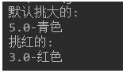

# 第1题

案例：榨汁机(Juicer)榨汁的案例，分别有水果(Fruit)苹果(Apple)香蕉(Banana)桔子(Orange)榨汁(squeeze)

开发提示：

​	1、声明(Fruit)水果接口，包含榨汁抽象方法：void squeeze();

​	2、声明榨汁机(Juicer)，包含运行方法：public void run(Fruit f)，方法体中，调用f的榨汁方法squeeze()

​	3、声明各种水果类，实现(Fruit)水果接口，并重写squeeze();

​	4、在src下，建立配置文件：config.properties，并在配置文件中配上fruitName=xxx（其中xx为某种水果的全类名）

​	5、在Test02测试类中，

​	（1）读取配置文件，获取水果类名，并用反射创建水果对象，

​	（2）创建榨汁机对象，并调用run()方法

答：

~~~java
public class Test2 {
    public static void main(String[] args) throws Exception {
        Properties p = new Properties();
        p.load(new FileInputStream(new File("作业/src/config.properties")));
        String fruitNames = p.getProperty("fruitName");
        String[] fruitNamess = fruitNames.split(",");

        Juicer j = new Juicer();
        Class<?> aClass = Class.forName(fruitNamess[0]);
        Object o = aClass.newInstance();
        if (o instanceof Apple) {
            j.run((Apple) o);
        }
        Class<?> aClass2 = Class.forName(fruitNamess[1]);
        Object o2 = aClass2.newInstance();
        if (o2 instanceof Banana) {
            j.run((Banana) o2);
        }
        Class<?> aClass3 = Class.forName(fruitNamess[2]);
        Object o3 = aClass3.newInstance();
        if (o3 instanceof Orange) {
            j.run((Orange) o3);
        }
    }
}

interface Fruit {
    void squeeze();
}

class Juicer {
    public void run(Fruit f) {
        f.squeeze();
    }
}

class Apple implements Fruit {
    @Override
    public void squeeze() {
        System.out.println("榨苹果汁");
    }
}

class Banana implements Fruit {
    @Override
    public void squeeze() {
        System.out.println("榨香蕉汁");
    }
}

class Orange implements Fruit {
    @Override
    public void squeeze() {
        System.out.println("榨橙子汁");
    }
}
~~~

config.properties

~~~java
fruitName=_8_20.Apple,_8_20.Banana,_8_20.Orange
~~~

# 第2题

需求：

定义一个Car类

属性有

String brand;

Double price;

String color

自定义注解，注解名:MyAnno，成员为value，此注解分别作用于上述类属性，通过反射，创建Car类对象，并将上述注解的成员值注入到属性并打印输出

~~~ java
class Car
{
    @MyAnno(value="特斯拉")
    String brand;
    @MyAnno(value="300000.00")
	Double price;
    @MyAnno(value="red")
	String color
}
~~~

答：

~~~java
public class Test3 {

    public static void main(String[] args) throws Exception {
        Class<?> aClass = Class.forName("_8_20.Car");
        Field[] fields = aClass.getDeclaredFields();
        Car car = (Car) aClass.newInstance();

        String[] values = new String[3];

        for (int i = 0; i < fields.length; i++) {
            MyAnno annotation = fields[i].getAnnotation(MyAnno.class);
            values[i] = annotation.value();
        }
        car.brand = values[0];
        car.price = Double.parseDouble(values[1]);
        car.color = values[2];

        System.out.println(car);

    }
}

class Car {
    @MyAnno(value = "特斯拉")
    String brand;
    @MyAnno(value = "300000.00")
    Double price;
    @MyAnno(value = "red")
    String color;

    @Override
    public String toString() {
        return "Car{" +
                "brand='" + brand + '\'' +
                ", price=" + price +
                ", color='" + color + '\'' +
                '}';
    }
}

@Retention(RetentionPolicy.RUNTIME)
@Target(ElementType.FIELD)
@interface MyAnno {
    String value();
}
~~~

# 第3题 

找出那些是正确Lambda表达式，如果是正确的Lambda表达式，则编写它对应的函数接口

1. ()->{}

2. ()->"Raou1" 等效于 ()->{return "Raou1"}

3. ()->{return "Mario";}

4. (Integer i)->return "Alan"+i;

5. (String s)->{"IronMan";}    

正确的lambda表达式：1,2,3

答：

~~~java
//1
interface A{
    void run();
}

//2
interface B{
    String run();
}
~~~

 # 第4题

2、以下哪些是使用Lambda表达式的有效方式？

（1）

​    execute(()->{});

​    public void execute(Runnable r){

​      r.run();

​    }

 

(2)

​    public Callable<String> fetch()

​    {

​      return ()->"Tricky example;";

​    }

 

(3)  Predicate<Apple> p=(Apple a)->a.getWeight();

答：都是错的

# 第5题

* 模拟工人挑苹果。

* 定义苹果类：

  * 属性：大小，颜色。
  * 提供基本的构造方法和get方法，set方法

* 定义接口CompareAble：

  * 定义默认方法compare，挑选较大苹果。

* 定义接口实现类CompareBig。

* 定义接口实现类CompareColor。挑选红色苹果。

* 定义工人类：

  * 成员方法：挑选苹果public void pickApple(CompareAble c,Apple a1,Apple a2)。

* 测试类：

  * 创建Worker对象。
  * 创建两个Apple对象，一个Apple（5，"青色"）,一个Apple（3，"红色"）

* 代码实现，效果如图所示：

  

  案例：改用Lambda实现实现接口，来代替CompareBig和CompareColor

~~~java
public class Test5 {
    public static void main(String[] args) {
        Apple2 a1 = new Apple2(5.0, "青色");
        Apple2 a2 = new Apple2(3.0, "红色");

        new Worker().pickApple(new CompareBig(), a1, a2);
        new Worker().pickApple(new CompareColor(), a1, a2);

        new Worker().pickApple((o1, o2) -> {
            if (o1.weight > o2.weight) {
                System.out.println("默认挑大的\n" + o1.weight + "-" + o1.color + "");
            } else {
                System.out.println("默认挑大的\n" + o2.weight + "-" + o2.color + "");
            }
        }, a1, a2);

        new Worker().pickApple((o1, o2) -> {
            if (o1.color == "红色") {
                System.out.println("挑红的\n" + o1.weight + "-" + o1.color + "");
            }
            if (o2.color == "红色") {
                System.out.println("挑红的\n" + o2.weight + "-" + o2.color + "");
            }
        }, a1, a2);
    }
}

class Apple2 {
    Double weight;
    String color;

    public Apple2() {
    }

    public Apple2(Double weight, String color) {
        this.weight = weight;
        this.color = color;
    }

    public Double getWeight() {
        return weight;
    }

    public void setWeight(Double weight) {
        this.weight = weight;
    }

    public String getColor() {
        return color;
    }

    public void setColor(String color) {
        this.color = color;
    }
}

interface CompareAble {
    void compare(Apple2 a1, Apple2 a2);
}

class CompareBig implements CompareAble {

    @Override
    public void compare(Apple2 a1, Apple2 a2) {
        if (a1.weight > a2.weight) {
            System.out.println("默认挑大的\n" + a1.weight + "-" + a1.color + "");
        } else {
            System.out.println("默认挑大的\n" + a2.weight + "-" + a2.color + "");
        }
    }
}

class CompareColor implements CompareAble {
    @Override
    public void compare(Apple2 a1, Apple2 a2) {
        if (a1.color == "红色") {
            System.out.println("挑红的\n" + a1.weight + "-" + a1.color + "");
        }
        if (a2.color == "红色") {
            System.out.println("挑红的\n" + a2.weight + "-" + a2.color + "");
        }
    }
}

class Worker {
    public void pickApple(CompareAble c, Apple2 a1, Apple2 a2) {
        c.compare(a1, a2);
    }
}
~~~

