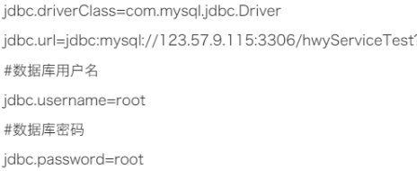

# 第1题 

- 每位学生（姓名，年龄）都有自己的家庭住址。将学生对象和家庭住址存储到map集合中。学生作为键, 家庭住址作为值，并使用keySet和entrySet方式遍历Map集合.（注意：学生姓名相同并且年龄相同视为同一名学生）

答：

~~~java
public class Test1 {
    public static void main(String[] args) {
        Map<Student, String> map = new HashMap<>();
        map.put(new Student("张三", 20), "城鳌大道999");
        map.put(new Student("李四", 20), "城鳌大道999");
        map.put(new Student("王五", 20), "城鳌大道999");
        map.put(new Student("张三", 20), "城鳌大道999");

        Set<Student> set = map.keySet();
        set.forEach(li -> System.out.println(li + "，地址：" + map.get(li)));

        Set<Map.Entry<Student, String>> entries = map.entrySet();
        entries.forEach(li -> System.out.println(li.getKey() + "，地址：" + li.getValue()));
    }
}

class Student {
    private String name;
    private int age;

    public Student(String name, int age) {
        this.name = name;
        this.age = age;
    }

    public String getName() {
        return name;
    }

    public void setName(String name) {
        this.name = name;
    }

    public int getAge() {
        return age;
    }

    public void setAge(int age) {
        this.age = age;
    }

    @Override
    public String toString() {
        return "Student{" +
                "name='" + name + '\'' +
                ", age=" + age +
                '}';
    }

    @Override
    public boolean equals(Object o) {
        if (this == o) return true;
        if (o == null || getClass() != o.getClass()) return false;
        Student student = (Student) o;
        return age == student.age &&
                name.equals(student.name);
    }

    @Override
    public int hashCode() {
        return Objects.hash(name, age);
    }
}
~~~

# 第2题 

- 键盘录入一个字符串,分别统计出其中英文字母、空格、数字和其它字符的数量,输出结果:"其他=1, 空格=2, 字母=12, 数字=6"

答：

~~~java
public class Test2 {
    public static void main(String[] args) {
        Scanner sc = new Scanner(System.in);
        System.out.println("请输入一段字符：");
        String str = sc.nextLine();

        int space = 0;//空格计数
        int a = 0;//字母计数
        int number = 0;//数字计数
        int other = 0;//其他字符计数
        for (int i = 0; i < str.length(); i++) {
            String str2 = str.substring(i, i + 1);
            if (" ".equals(str2)) {
                space++;
            } else if (str2.matches("\\d")) {
                number++;
            } else if (str2.matches("[a-zA-Z]")) {  //中文不会
                a++;
            } else {
                other++;
            }
        }

        System.out.println("其他=" + other + ",空格=" + space + ",字母=" + a + ",数字=" + number);
    }
}
~~~

# 第3题

- 通过Properties类读取数据库参数文件（url、user、password、drivername）

答：

~~~java
public class Test3 {
    public static void main(String[] args) throws IOException {
        Properties pp = new Properties();
        pp.load(new FileReader("作业/jdbc.ini"));

        System.out.println(pp.get("jdbc.driverClass"));
        System.out.println(pp.get("jdbc.url"));
        System.out.println(pp.get("jdbc.username"));
        System.out.println(pp.get("jdbc.password"));
    }
}
~~~

#  第4题 

使用HashMap类实例化一个Map类型的对象m1，键（String类型）和值（int型）分别用于存储员工的姓名和工资，存入数据如下：

张三——800元；李四——1500元；王五——3000元；

1）将张三的工资更改为2600元

2）为所有员工工资加薪100元；

3）遍历集合中所有的员工

4）遍历集合中所有的工资

答：

~~~java
public class Test4 {
    public static void main(String[] args) {
        Map<String, Integer> m1 = new HashMap<>();
        m1.put("张三", 800);
        m1.put("李四", 1500);
        m1.put("王五", 3000);

        m1.put("张三", 2600);

        m1.forEach((k, v) -> {
            v += 100;
            m1.put(k, v);
        });

        m1.forEach((k, v) -> System.out.println("员工：" + k));
        m1.forEach((k, v) -> System.out.println("工资：" + v));

    }
}
~~~

# 第5题

使用Map接口的实现类完成员工工资(姓名--工资)的摸拟：

1)添加几条信息

2)列出所有的员工姓名

3列出所有员工姓名及其工资

4)删除名叫“Tom”的员工信息

5)输出Jack的工资，并将其工资加1000元(通过取值实现)

6)将所有工资低于1000元的员工的工资上涨20%(通过取值实现)

答：

~~~java
public class Test5 {
    public static void main(String[] args) {
        Map<String, Integer> map = new HashMap<>();
        map.put("Jack", 600);
        map.put("Tom", 500);
        map.put("张三", 2400);
        map.put("李四", 890);

        map.forEach((k, v) -> System.out.println("员工" + k));

        map.forEach((k, v) -> System.out.println("员工：" + k + ",工资：" + v));

        map.remove("Tom");

        System.out.println(map.get("Jack"));

        map.put("Jack", map.get("Jack") + 1000);

        map.forEach((k, v) -> {
            if (v < 1000) {
                v = v + (int) (v * 0.2);
            }
            map.put(k, v);
        });

        map.forEach((k, v) -> System.out.println("员工：" + k + ",工资：" + v));

    }
}
~~~

