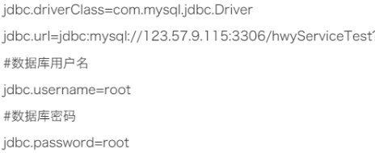

# 第1题 

- 每位学生（姓名，年龄）都有自己的家庭住址。将学生对象和家庭住址存储到map集合中。学生作为键, 家庭住址作为值，并使用keySet和entrySet方式遍历Map集合.（注意：学生姓名相同并且年龄相同视为同一名学生）

# 第2题 

- 键盘录入一个字符串,分别统计出其中英文字母、空格、数字和其它字符的数量,输出结果:"其他=1, 空格=2, 字母=12, 数字=6"

# 第3题

- 通过Properties类读取数据库参数文件（url、user、password、drivername）

#  第4题 

使用HashMap类实例化一个Map类型的对象m1，键（String类型）和值（int型）分别用于存储员工的姓名和工资，存入数据如下：

张三——800元；李四——1500元；王五——3000元；

1）将张三的工资更改为2600元

2）为所有员工工资加薪100元；

3）遍历集合中所有的员工

4）遍历集合中所有的工资

# 第5题

使用Map接口的实现类完成员工工资(姓名--工资)的摸拟：

1)添加几条信息

2)列出所有的员工姓名

3列出所有员工姓名及其工资

4)删除名叫“Tom”的员工信息

5)输出Jack的工资，并将其工资加1000元(通过取值实现)

6)将所有工资低于1000元的员工的工资上涨20%(通过取值实现)