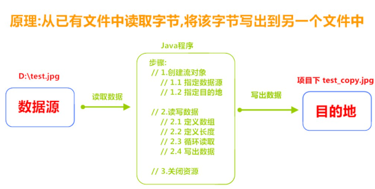

# 第1题 

编写一个应用程序，将用户从键盘输入的10个整数存入文件，从文件读取再顺序读出。

答：

~~~java
public class Test1 {
    public static void main(String[] args) {
        Scanner sc = new Scanner(System.in);

        try (Reader is = new FileReader("作业/test1.txt");
             OutputStream os = new FileOutputStream("作业/test1.txt")) {
            for (int i = 0; i < 10; i++) {
                System.out.println("请输入第" + (i + 1) + "个整数：");
                String str = String.valueOf(sc.nextInt());
                os.write(str.getBytes());
            }

            char[] b = new char[1024];
            int len;
            while ((len = is.read(b)) != -1) {
                System.out.println(String.valueOf(b, 0, len));
            }

        } catch (FileNotFoundException e) {
            e.printStackTrace();
        } catch (IOException e) {
            e.printStackTrace();
        }
    }
}
~~~

# 第2题 

编写一个应用程序，使用字符流实现文件内容复制功能

答：

~~~java
public static void main(String[] args) {
        String src = "作业/test1.txt";
        String des = "作业/test2.txt";

        try (Reader r = new FileReader(src);
             Writer w = new FileWriter(des);) {

            char[] b = new char[8];
            int len;
            while ((len = r.read(b)) != -1) {
                w.write(b, 0, len);
            }
        } catch (FileNotFoundException e) {
            e.printStackTrace();
        } catch (IOException e) {
            e.printStackTrace();
        }
    }
~~~

# 第3题 

**利用字节输出流对象往C盘下c.txt文件输出5句："i love java"**

> 要求：
>
> 1.不能覆盖文件中原有的内容
>
> 2.每一句输出各占一行

答：

~~~java
public static void main(String[] args) {
        try (OutputStream os = new FileOutputStream("作业/c.txt");) {
            for (int i = 0; i < 5; i++)
                os.write("i love java\r".getBytes());

        } catch (IOException e) {
            e.printStackTrace();
        }

    }
~~~

# 第4题

图片复制

答：

~~~java
public static void main(String[] args) {
        try (InputStream is = new FileInputStream(new File("D:/test.jpg"));
             OutputStream os = new FileOutputStream(new File("作业/test_copy.jpg"));) {

            byte[] b = new byte[1024];
            int len;
            while ((len = is.read(b)) != -1) {
                os.write(b, 0, len);
            }
        } catch (FileNotFoundException e) {
            e.printStackTrace();
        } catch (IOException e) {
            e.printStackTrace();
        }
    }
~~~

