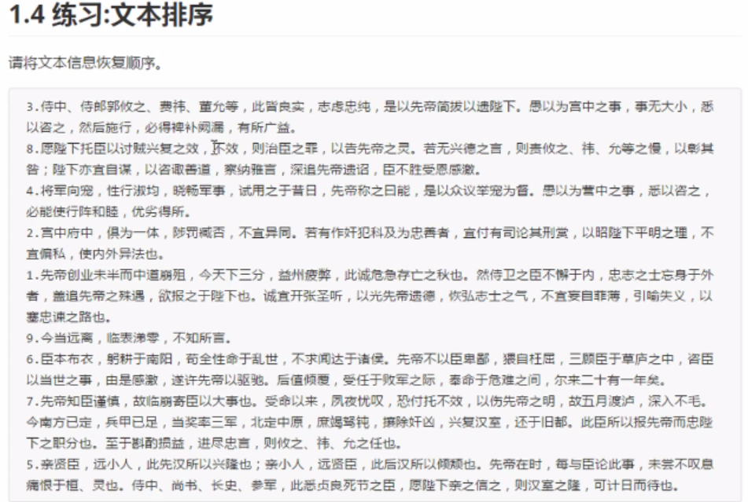

# 题目1：缓冲流的效率测试

```none
文件复制练习:一读一写
需求：复制文件共耗时对比

    明确:
        数据源: c:\\1.jpg
        数据的目的地: d:\\1.jpg

    文件复制的步骤:
        1.创建一个字节输入流对象,构造方法中绑定要读取的数据源
        2.创建一个字节输出流对象,构造方法中绑定要写入的目的地
        3.使用字节输入流对象中的方法read读取文件
        4.使用字节输出流中的方法write,把读取到的字节写入到目的地的文件中
        5.释放资源
    文件的大小:780,831 字节
```

答：

~~~java
public class Demo3 {
	public static void main(String[] args) {
		File f = new File("E:\\java\\javase\\10.IO流\\01.上课视频\\01.File的介绍及基本操作.mp4");

		// 节点流
		try (InputStream is = new FileInputStream(f);
				OutputStream os = new FileOutputStream(new File("C:/Users/15524/桌面/copy.mp4"));) {
			byte[] b = new byte[1024];
			int len;
			// 获取当前时间
			long start = System.currentTimeMillis();
			while ((len = is.read(b)) != -1) {
				os.write(b, 0, len);
			}
			long end = System.currentTimeMillis();
			System.out.println("节点流的耗时：" + (end - start));

		} catch (Exception e) {
			e.printStackTrace();
		}

		// 处理流
		try (InputStream is = new FileInputStream(f);
				BufferedInputStream bis = new BufferedInputStream(is);
				OutputStream os = new FileOutputStream(new File("C:/Users/15524/桌面/copy.mp4"));
				BufferedOutputStream bos = new BufferedOutputStream(os);) {
			byte[] b = new byte[1024];
			int len;
			// 获取当前时间
			long start = System.currentTimeMillis();
			while ((len = bis.read(b)) != -1) {
				bos.write(b, 0, len);
			}
			long end = System.currentTimeMillis();
			System.out.println("处理流的耗时：" + (end - start));

		} catch (Exception e) {
			e.printStackTrace();
		}

	}

}
~~~


# 题目2：

利用转换输入流将当前项目根目录下使用gbk编码的a.txt文件的内容读取出来，并打印在控制台上。

要求：

不能出现乱码的情况。

答：

~~~java
public class Test1 {
    public static void main(String[] args) {
        try (InputStream is = new FileInputStream("a.txt");
             InputStreamReader isr = new InputStreamReader(is, "gbk")) {
            char[] c = new char[16];
            int len;
            while ((len = isr.read(c)) != -1) {
                System.out.print(new String(c, 0, len));
            }
        } catch (Exception e) {
            e.printStackTrace();
        }

    }
}
~~~


# 题目3：

- 通过BufferedReader和转换流，实现不断获取键盘输入的内容，打印输出控制台

答：

~~~java
public class Test2 {
    public static void main(String[] args) {
        Scanner sc = new Scanner(System.in);

        try (BufferedWriter bw = new BufferedWriter(new FileWriter("a.txt"));
             InputStream is = new FileInputStream("a.txt");
             InputStreamReader isr = new InputStreamReader(is, "utf-8");
             BufferedReader br = new BufferedReader(isr);) {
            while (sc.hasNext()) {
                String str = sc.nextLine();
                bw.write(str + "\r");
                bw.flush();
                System.out.println(br.readLine());
            }
        } catch (UnsupportedEncodingException e) {
            e.printStackTrace();
        } catch (FileNotFoundException e) {
            e.printStackTrace();
        } catch (IOException e) {
            e.printStackTrace();
        }
    }
}

~~~


# 题目4：

- 修改重定向标准输出及标准错误输出，重定向标准输出到d.txt文件。标准错误输出到e.txt

答：

~~~java
public class Test3 {
    public static void main(String[] args) throws FileNotFoundException {
        System.setOut(new PrintStream("d.txt"));
        System.setErr(new PrintStream("e.txt"));

        System.out.println("hello,world");
        System.err.println("hello,world");
    }
}
~~~


# 题目5:



答：

~~~java
public class Test4 {
    public static void main(String[] args) {
        try (BufferedReader br = new BufferedReader(new FileReader("a.txt"));
             BufferedWriter bw = new BufferedWriter(new FileWriter("b.txt"));) {

            StringBuilder[] s = new StringBuilder[10];
            String str = "";
            for (int i = 0; i < 10; i++) {
                s[i] = new StringBuilder();
            }
            int j = 0;
            while ((str = br.readLine()) != null) {
                if (str.substring(0, 1).matches("\\d")) {
                    j = Integer.parseInt(str.substring(0, 1));
                    System.out.println(j);
                }
                s[j].append(str);
            }


            for (int i = 1; i < s.length; i++) {
                if (s[i] != null) {
                    System.out.println(s[i].toString());
                    bw.write(s[i].toString() + "\r");
                    bw.flush();
                }
            }

        } catch (Exception e) {
            e.printStackTrace();
        }

    }
}
~~~

