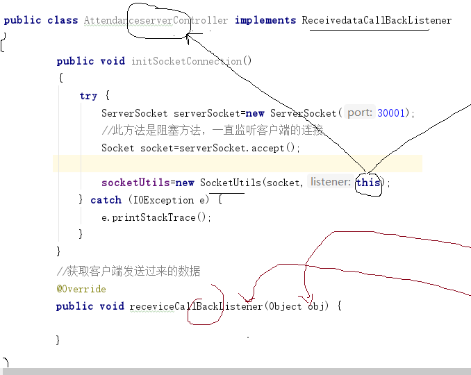
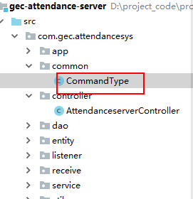

# 考勤项目功能一

# 一、项目整体架构搭建

## 1、服务器登录代码架构实现

  

### a、基于java经典三层架构设计


- 分包处理

  

### b、员工的实体类


- Employee类的实现

  ~~~ java
  package com.gec.attendancesys.entity;
  
  import java.io.Serializable;
  import java.util.Date;
  
  /*
  * create table t_employee
  (
  	employee_id   int auto_increment primary key,
  	employee_no   varchar(20),
  	employee_name varchar(20),
  	login_name    varchar(20),
  	pass_word     varchar(20),
  	job           varchar(20),
  	hiredate      date,
  	sal           numeric(7,2),
  	role          int
  );
  根据数据库表定义实体类
  * */
  public class Employee implements Serializable {
  
      private Integer employeeId;
      private String employeeNo;
      private String employeeName;
      private String loginName;
      private String password;
      private String job;
      private Date hiredate;
      private Double sal;
      private Integer role;
  
      public Integer getEmployeeId() {
          return employeeId;
      }
  
      public void setEmployeeId(Integer employeeId) {
          this.employeeId = employeeId;
      }
  
      public String getEmployeeNo() {
          return employeeNo;
      }
  
      public void setEmployeeNo(String employeeNo) {
          this.employeeNo = employeeNo;
      }
  
      public String getEmployeeName() {
          return employeeName;
      }
  
      public void setEmployeeName(String employeeName) {
          this.employeeName = employeeName;
      }
  
      public String getLoginName() {
          return loginName;
      }
  
      public void setLoginName(String loginName) {
          this.loginName = loginName;
      }
  
      public String getPassword() {
          return password;
      }
  
      public void setPassword(String password) {
          this.password = password;
      }
  
      public String getJob() {
          return job;
      }
  
      public void setJob(String job) {
          this.job = job;
      }
  
      public Date getHiredate() {
          return hiredate;
      }
  
      public void setHiredate(Date hiredate) {
          this.hiredate = hiredate;
      }
  
      public Double getSal() {
          return sal;
      }
  
      public void setSal(Double sal) {
          this.sal = sal;
      }
  
      public Integer getRole() {
          return role;
      }
  
      public void setRole(Integer role) {
          this.role = role;
      }
  }
  
  ~~~

### c、员工的登录dao类代码实现


- 员工的dao接口

  - 作用
    
  - 降低依赖，实现解耦
    
  - 代码

    ~~~ java
    package com.gec.attendancesys.dao;
    
    import com.gec.attendancesys.entity.Employee;
    
    import java.sql.SQLException;
    
    /*
       定义员工dao实现的方法规范
    */
    public interface EmployeeDao {
    
        //根据员工的登录名及密码获取员工数据信息
        public Employee findEmployeeByLoginAndPassword(Employee employee) throws SQLException;
    }
    
    ~~~

- 员工dao的实现类

  - EmployeeDaoImpl.java

  ~~~ java
  package com.gec.attendancesys.dao.impl;
  
  import com.gec.attendancesys.dao.EmployeeDao;
  import com.gec.attendancesys.entity.Employee;
  import com.gec.attendancesys.utils.DbUtils;
  
  import java.sql.Connection;
  import java.sql.PreparedStatement;
  import java.sql.ResultSet;
  import java.sql.SQLException;
  
  public class EmployeeDaoImpl implements EmployeeDao {
  
      @Override
      public Employee findEmployeeByLoginAndPassword(Employee employee) throws SQLException {
  
          String sql="select * from t_employee where login_name=? and pass_word=?";
          //获取Connection的连接对象
          Connection connection = DbUtils.openConn();
  
          PreparedStatement pstmt = connection.prepareStatement(sql);
          pstmt.setString(1,employee.getLoginName());
          pstmt.setString(2,employee.getPassword());
  
          //执行sql，获取结果集
          ResultSet rs = pstmt.executeQuery();
  
          //如果rs.next返回值为true：则确认用户登录成功，此用户存在
          while (rs.next()){
              Employee outEmployee=new Employee();
              outEmployee.setEmployeeId(rs.getInt(1));
              outEmployee.setEmployeeNo(rs.getString(2));
              outEmployee.setEmployeeName(rs.getString(3));
              outEmployee.setLoginName(rs.getString(4));
              outEmployee.setPassword(rs.getString(5));
              outEmployee.setJob(rs.getString(6));
              outEmployee.setHiredate(rs.getDate(7));
              outEmployee.setSal(rs.getDouble(8));
              outEmployee.setRole(rs.getInt(9));
  
              return outEmployee;
          }
  
          //如果为null，则登录失败
          return null;
      }
  }
  
  ~~~

### d、dao层的工厂类

- 工厂类的作用：创建Dao对象，实现dao对象解耦


- DaoFactory代码实现

  ~~~ java
  package com.gec.attendancesys.dao;
  
  import com.gec.attendancesys.dao.impl.EmployeeDaoImpl;
  
  /*
  * 定义一个Dao工厂：
  * 作用：产生dao对象，实现解耦
  * */
  public class DaoFactory {
  
      public static EmployeeDao createEmployeeDao()
      {
          return new EmployeeDaoImpl();
      }
  }
  
  ~~~

### e、service层的实现

- 作用：实现登录逻辑处理

- 员工service的接口

  

  ~~~ java
  package com.gec.attendancesys.service;
  
  import com.gec.attendancesys.entity.Employee;
  
  /*
  * 定义员工业务类接口：定义登录业务功能的规范
  * */
  public interface EmployeeService {
  
      public Employee login(Employee employee);
  
  }
  
  ~~~

- 员工service实现类

  

  ~~~ java
  package com.gec.attendancesys.service.impl;
  
  import com.gec.attendancesys.dao.DaoFactory;
  import com.gec.attendancesys.dao.EmployeeDao;
  import com.gec.attendancesys.entity.Employee;
  import com.gec.attendancesys.service.EmployeeService;
  import com.gec.attendancesys.utils.DbUtils;
  
  import java.sql.SQLException;
  
  /*
  * 定义员工业务类的实现
  * 1、员工登录认证功能
  * */
  public class EmployeeServiceImpl implements EmployeeService {
  
      private EmployeeDao employeeDao;
  
      public EmployeeServiceImpl(){
          //通过工厂类，获取Dao对象
          employeeDao= DaoFactory.createEmployeeDao();
      }
  
  
      /*
      * 此方法返回值null，则登录失败，否则登录成功
      *
      * */
      @Override
      public Employee login(Employee employee) {
  
          Employee result=null;
  
          try {
              result=employeeDao.findEmployeeByLoginAndPassword(employee);
          } catch (SQLException e) {
              e.printStackTrace();
          }finally {
              try {
                  DbUtils.closeConn();
              } catch (SQLException e) {
                  e.printStackTrace();
              }
          }
          return result;
      }
  }
  
  ~~~

### f、定义一个回调接口

- 回调接口作用：当读取到客户端的数据，回调接口立即起作用，将数据返回给控制器

  

  ~~~ java
  package com.gec.attendancesys.listener;
  
  public interface ReceivedataCallBackListener {
  
      //定义一个回调方法
      //参数：传输网络数据
      public void receviceCallBackListener(Object obj);
  }
  ~~~

### g、读取数据的线程类

- 不断监听读取客户端发送过来的数据

  

~~~ java
package com.gec.attendancesys.receive;

import com.gec.attendancesys.listener.ReceivedataCallBackListener;

import java.io.IOException;
import java.io.ObjectInputStream;

/*
* 此子线程不断侦听客户端发送过来的数据
* */
public class ReceiveReadDataThread extends Thread {

    //通过对象输入流，读取客户端的对象数据
    private ObjectInputStream objectInputStream;
    //定义一个监听器回调对象
    private ReceivedataCallBackListener listener;
    //定义一个标记变量，控制线程是否结束
    public volatile boolean flag=false;

    public ReceiveReadDataThread(ObjectInputStream objectInputStream,ReceivedataCallBackListener listener) {
        this.objectInputStream = objectInputStream;
        this.listener=listener;
    }

    @Override
    public void run() {

        //不断读取客户端的数据消息
        while (!flag){

            try {
                //通过readObject方法读取对象数据
                Object readObject=objectInputStream.readObject();
                //将读取数据立刻调用监听器处理
                listener.receviceCallBackListener(readObject);
            } catch (IOException e) {
                e.printStackTrace();
            } catch (ClassNotFoundException e) {
                e.printStackTrace();
            }
        }

    }
}

~~~

### h、socket的工具类


- 定义SocketUtils

  - 作用

    - ```
      * 1、初始化对象流（ObjectInputStream和ObjectOutputStream）
      * ObjectInputStream：读对象数据
      * ObjectOutputStream：写对象数据
      * 2、启动读取数据的线程类
      * 3、实现写对象操作方法
      ```

  - 代码

    ~~~ java
    package com.gec.attendancesys.utils;
    
    
    import com.gec.attendancesys.listener.ReceivedataCallBackListener;
    import com.gec.attendancesys.receive.ReceiveReadDataThread;
    
    import java.io.IOException;
    import java.io.ObjectInputStream;
    import java.io.ObjectOutputStream;
    import java.net.Socket;
    
    /*
    * 1、初始化ObjectInputStream及ObjectOutputStream对象
    *   ObjectInputStream对象：读取客户端的对象数据
    *   ObjectOutputStream对象：将对象数据写出给客户端
    * 2、启动子线程：不断侦听读取客户端数据（读取）
    * 3、定义一个写数据的方法（写）
    * */
    public class SocketUtils {
    
        private ObjectInputStream objectInputStream;
        private ObjectOutputStream objectOutputStream;
        //定义一个线程对象，控制线程
        private ReceiveReadDataThread receiveReadDataThread;
    
        public SocketUtils(Socket socket, ReceivedataCallBackListener listener){
    
            try {
                //通过socket对象获取输出流，包装成对象输出流
                objectOutputStream=new ObjectOutputStream(socket.getOutputStream());
                //通过socket对象获取输入流，包装成对象输入流
                objectInputStream=new ObjectInputStream(socket.getInputStream());
    
                //启动子线程
                receiveReadDataThread= new ReceiveReadDataThread(objectInputStream, listener);
                receiveReadDataThread.start();
    
    
            } catch (IOException e) {
                e.printStackTrace();
            }
        }
    
        /*
         * 创建一个子丝程，实现写对象操作
         * */
        public void writeObject(Object object)
        {
            new Thread(()->{
                try {
                    objectOutputStream.writeObject(object);
                } catch (IOException e) {
                    e.printStackTrace();
                }
            }).start();
        }
    
    }
    
    ~~~

### i、控制器如何实现

- 初始化ServerSocket对象，绑定端口
- 实现回调接口
  - 原因控制器就是回调接口对象




- 定义指令类型的类

  

  ~~~ java
  package com.gec.attendancesys.common;
  
  public class CommandType {
  
      //注册员工的指令类型
      public final static String REGISTER_EMP_REQUEST="1";
      //注册员工的响应指令类型
      public final static String REGISTER_EMP_RESPONSE="2";
      public final static String EMP_LOGIN="3";
      public final static String EMP_LOGIN_RESPONSE="4";
      public final static String CLOCK_IN_TIME="5";
      public final static String CLOCK_OFF_TIME="6";
      public final static String CLOCK_IN_TIME_RESPONSE="7";
      public final static String CLOCK_OFF_TIME_RESPONSE="8";
      public final static String ATTENDANCE_REQUEST="9";
      public final static String ATTENDANCE_RESPONSE="10";
  
  }
  
  ~~~

  

- 控制器代码实现

  - ```
    * 1、初始化ServerSocket对象，绑定port
    * 2、必须实现回调接口
    * 3、根据接受客户端发送过来的请求指令，委派业务层处理
    * 4、处理完成请求指令之后，对客户端作出响应处理
    ```

  ~~~ java
  package com.gec.attendancesys.controller;
  
  import com.gec.attendancesys.common.CommandType;
  import com.gec.attendancesys.entity.Employee;
  import com.gec.attendancesys.listener.ReceivedataCallBackListener;
  import com.gec.attendancesys.service.EmployeeService;
  import com.gec.attendancesys.service.impl.EmployeeServiceImpl;
  import com.gec.attendancesys.utils.SocketUtils;
  
  import java.io.IOException;
  import java.net.ServerSocket;
  import java.net.Socket;
  import java.util.HashMap;
  
  /*
  * 1、初始化ServerSocket对象，绑定port
  * 2、必须实现回调接口
  * 3、根据接受客户端发送过来的请求指令，委派业务层处理
  * 4、处理完成请求指令之后，对客户端作出响应处理
  *
  * */
  public class AttendanceserverController implements ReceivedataCallBackListener {
  
      private SocketUtils socketUtils;
      private EmployeeService employeeService;
  
      public AttendanceserverController()
      {
          employeeService=new EmployeeServiceImpl();
      }
  
      public void doAction()
      {
          initSocketConnection();
      }
  
      public void initSocketConnection()
      {
          try {
              System.out.println("建立服务端口30001");
              ServerSocket serverSocket=new ServerSocket(30001);
              //此方法是阻塞方法，一直监听客户端的连接
              Socket socket=serverSocket.accept();
              socketUtils=new SocketUtils(socket,this);
          } catch (IOException e) {
              e.printStackTrace();
          }
      }
  
  
      //获取客户端发送过来的数据
      @Override
      public void receviceCallBackListener(Object result) {
  
          System.out.println("读取客户端的数据="+result);
          HashMap<String, Object> resultMap=(HashMap<String, Object>) result;
  
          resultMap.forEach((k,v)->{
  
              if(k.equals(CommandType.EMP_LOGIN))
              {
                  //客户端发送过来的数据部分进行解释
                  Employee employee= (Employee) v;
                  Employee outEmployee=login(employee);
  
                  //针对客户端作出响应结果
                  HashMap<String, Object> responseData=new HashMap<>();
                  responseData.put(CommandType.EMP_LOGIN_RESPONSE,outEmployee);
                  socketUtils.writeObject(responseData);
              }
          });
      }
  
      public Employee login(Employee employee)
      {
          return employeeService.login(employee);
      }
  }
  
  ~~~

  