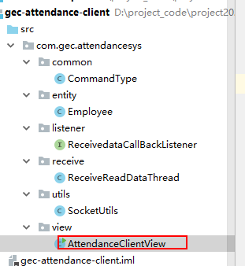

# 考勤系统客户端架构实现

# 一、客户端实现

## 1、实体类

- 复用服务器的实体类，必须是服务端的实体类`一致`

## 2、回调接口

- 参考服务端的回调接口

## 3、读取数据的多线程

- 参考服务端的读取数据的多线程

## 4、Socket的工具类

- 参考服务端的Socket工具类

## 5、指令常量类

- 跟服务端的指令常量类一致

## 6、客户端应用的实现



- 作用

  ```
  /*
  * 1、连接服务器的ServerSocket
  * 2、实现回调接口，获取服务端的响应数据
  * 3、根据用户选择的菜单内容，将请求指令及数据发送到服务端处理
  * */
  ```

-  AttendanceClientView.java

  ~~~ java
  package com.gec.attendancesys.view;
  
  import com.gec.attendancesys.common.CommandType;
  import com.gec.attendancesys.entity.Employee;
  import com.gec.attendancesys.listener.ReceivedataCallBackListener;
  import com.gec.attendancesys.utils.SocketUtils;
  
  import java.io.IOException;
  import java.net.Socket;
  import java.util.HashMap;
  import java.util.Scanner;
  
  /*
  * 1、连接服务器的ServerSocket
  * 2、实现回调接口，获取服务端的响应数据
  * 3、根据用户选择的菜单内容，将请求指令及数据发送到服务端处理
  * */
  public class AttendanceClientView implements ReceivedataCallBackListener {
  
      //记录登录成功之后的员工信息
      private Employee employee;
      private SocketUtils socketUtils;
      private Scanner sc=new Scanner(System.in);
  
      public static void main(String[] args) {
  
          AttendanceClientView client=new AttendanceClientView();
          client.doAction();
  
      }
  
      private void connectionSocketServer()
      {
          try {
              Socket socket=new Socket("127.0.0.1",30001);
              if(socket!=null && socket.isConnected())
              {
                  System.out.println("连接服务器成功");
                  socketUtils=new SocketUtils(socket,this);
              }
  
          } catch (IOException e) {
              e.printStackTrace();
          }
      }
  
      /*
      * 启动客户端
      * */
      public void doAction()
      {
          System.out.println("欢迎进入粤嵌考勤智能指挥系统");
          connectionSocketServer();
          inputLoginInfo();
      }
  
  
      /*
      * 实现登录信息输入菜单内容
      * */
      public void inputLoginInfo()
      {
          //获取键盘内容
          System.out.println("请输入登录名：");
          String loginName = sc.nextLine();
          System.out.println("请输入密码：");
          String password = sc.nextLine();
  
          //登录数据封装Employee对象
          Employee loginEmp=new Employee();
          loginEmp.setLoginName(loginName);
          loginEmp.setPassword(password);
  
          //将登录员工信息封装成HashMap对象
          HashMap<String,Object> data=new HashMap<>();
          data.put(CommandType.EMP_LOGIN,loginEmp);
          socketUtils.writeObject(data);
  
      }
  
      /*
      * 接受服务端的响应数据
      * */
      @Override
      public void receviceCallBackListener(Object result) {
  
          HashMap<String, Object> resultMap=(HashMap<String, Object>) result;
  
          resultMap.forEach((k,v)->{
  
              if(k.equals(CommandType.EMP_LOGIN_RESPONSE))
              {
                  Object responseResult=resultMap.get(CommandType.EMP_LOGIN_RESPONSE);
  
                  if(responseResult==null)
                  {
                      //登录失败
                      System.out.println("登录失败，请重新登录！");
                      //返回录入登录名及密码页面
                      inputLoginInfo();
                  }else {
                      System.out.println("登录成功");
                      Employee employee= (Employee) responseResult;
                      this.employee=employee;
                      //进入主菜单
                      System.out.println("进入主菜单");
                  }
              }
          });
  
      }
  }
  
  ~~~

  