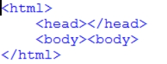
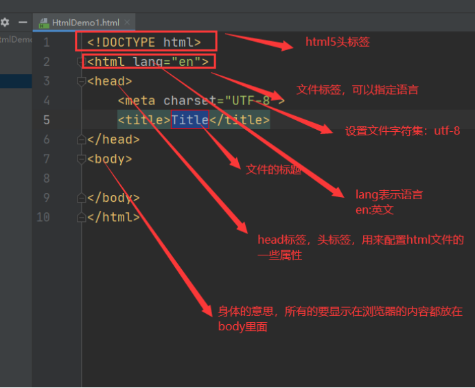
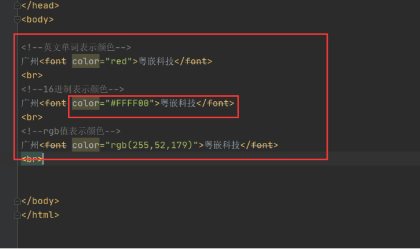

# 1.HTML

# 第一章 Html介绍

（静态网页技术）

## 一.1.什么是html? 

Html不是编程语言，是标记语言，就是一堆有特殊含义的标记

Html是用来描述网页的一种语言。

HTML 指的是超文本标记语言 (Hyper Text Markup Language)

超文本：功能比普通文本更加强大标记语言：使用一组标签对内容进行描述的语言， 

HTML 不是一种编程语言，而是一种标记语言 (markup language)

标记语言是一套标记标签 (markup tag)

HTML 使用标记标签来描述网页

## 一.2. Html的作用？

Web浏览器的作用是读取html文档，并以网页的形式显示它们。浏览器不会显示html标签，而是使用标签来解释页面上的内容.

简单说，html就是用于展示信息的。

## 一.3. Html书写规范

1. HTML 标记标签通常被称为 HTML 标签 (HTML tag)。

* HTML 标签是由尖括号包围的关键词，比如 <html>

* HTML 标签通常是成对出现的，比如 < b>和< /b>

* 标签对中的第一个标签是开始标签，第二个标签是结束标签

* 绝大多数的标签都具有属性,建议属性值使用引号引起。例如:<body text="red">

* 大多数标签是可以嵌套的

2. Html创建 

Html文件可以直接使用文本编辑器来创建，保存时，后缀名为html或htm

整个文件是在<html>与</html>标签之间在<html>标签间有<head>与<body>子标签。

例如:

 

3. 空的html标签 

* 没有内容的 HTML 元素被称为空元素。空元素是在开始标签中关闭的。

*    就是没有关闭标签的空元素（< br>标签定义换行）。

* 在开始标签中添加斜杠，比如 < br/>，是关闭空元素的正确方法，HTML、XHTML 和 XML     都接受这种方式。

* 即使 < br> 在所有浏览器中都是有效的，但使用 < br /> 其实是更长远的保障。

4.  Html大小写不敏感 

HTML 标签对大小写不敏感：
 等同于 
。许多网站都使用大写的 HTML 标签。

W3School 使用的是小写标签，因为万维网联盟（W3C）在 HTML 4 中推荐使用小写，而在未来 (X)HTML 版本中强制使用小写

## 前端

前端就是显示给客户看，技术如何不管，界面要好看

Html5方向：

Html html5,javascript,css3,

框架：

jquery框架

Bootstarp 框架

Vue框架

 

不学常见的框架：

Easy ui

Layui

Angular.js

Node.js

 

开发工具：

webStorm

Hbuilder

Idea

# 文件标签

## html文件结构

1. html标签

整个文件都处于<html>标签中.

<HTML>用以声明这是 HTML 文件，让浏览器认出并正确处理此 HTML 文件。

在HTML文件有两部分<head>与<body>

2. head标签

<head>用于加载一些重要的资讯

​		它的内容不会被显示，只有<body>的内容才会被显示	

3. title标签

< title>只能出现于< head>中，它代表的是标题

4. body标签

5. 关于html中颜色取值

颜色由红色、绿色、蓝色混合而成

有三种取取值方式:

​	1.rgb(0,0,0)  值是在0-255之间

​	2. #000000  #ff0000  #00ff00  #0000ff  #ffffff

​	3.red  green  blue	

## 排版标签

1. 注释

在html中注释是<!--注释 -->

在html中使用注释的目的与java中一样。

2. p标签

标签是段落标签，可以将html文档分割为若干段落。浏览器会自动在段落前后添加空格。

标签常用属性

* align:用于设定对齐方式 可选值 left right center 默认值是left.

3. br标签

 标签是换行标签。

因为浏览器会自动的忽略空白与换行，因此 标签成为了我们最常用的标签。

4. hr标签

< hr>标签会生成一条水平线。

常用属性:

* align:设置水平线对齐方式 可选值 left right center

* size:设置水平线厚度 以像素为单位。默认为2

* width:设置水平线长度.可以是绝对值或相对值。默认为100%

* color:设置水平线颜色.默认为黑色

 

5. 关于html中数值单位

Html的数值默认单位为像素(px).

在有些位置可以使用百分比来设置。

例如:

< hr size='3'>这个就代表水平线厚席为3px.

< hr width='30%'>这个就代表水平线长度为总长度的30%.

~~~html
<!--hr水平线 html属性设置-->

<!--hr水平线 css设置html标签的属性-->

~~~

基本上都是用css了，html的知道有就行

## 块标签

1. div标签

用于在文档中设定一个块区域。自带换行

常用属性：

align:left center right

2. span标签

用于在行内设定一个块区域（可以对行内的特定区域使用）。不会换行

Html中绝大多数元素被定义为块级元素或内联元素。

块级元素在浏览器显示时，通常会以新行来开始。例如 div p等

内联元素在浏览器显示时，通常不会以新行来开始。span

## 字体标签

1. font

标签用于规定文本的字体，大小，颜色。

常用属性:

* face:规定文本的字体

* size:规定文本的大小

* color:规定文本的颜色

~~~html
<!--size最大是7-->
粤嵌科技
<!--用css设置可以指定的-->
粤嵌科技
~~~

1. h1-h6 h1到h6就是预设的字体的样式，可以直接使用

< h1>-< h6>标签用于定义标题.

< h1>最大标题

< h6>最小标题

## 列表标签

1. ul

<ul>标签表示的是一个无序列表。

常用属性:

* type:规定列表的项目符号类型,可取值 disc,square,circle.默认值为disc

2. li

<li>标签表示的是一个列表项

常用属性:

* type:这个属性只适用于无序列表，用于设定项目符号，默认值为disc

* value:这个属性只适用于有序列表，用于设定列表的项目数字

3.  ol

<ol>表示的是一个有序列表。

常用属性:

* type:这个属性规定列表中使用的标记类型。可取值1 A a I i.

* start:这个属性规定列表的起始值

li是跟着列表标签使用的

## 图片标签

1. img

是一个图片标签，用于在页面上引入图片.

常用属性：

* src:用于设定要引入的图片的url

* alt:用于设定图片找不到时图像的替代文字

* width:用于设定图片的宽度

* height:用于设定图片的高度

* border：图片边框厚度

* align:用于设定图片的文字的对齐方式

## 超链接

1. a 

<a>标签用于定义超连接，用于从一个页面链接到另一个页面。

常用属性:

* href:用于设定链接指向页面的url.

* name:用于设定锚的名称

* target:用于设定在何处打开链接页面。

~~~html

<a href="https://jd.com" style="text-decoration: none;font-size: 10px;color: #CCCCCC" target="_blank">友情链接：京东</a>
~~~

如果超链接不想做任何事，加一个#。不加的话会刷新页面

~~~html

~~~

## 表格

1. table 

<table>标签用于定义表格

常用属性:

* align:用于设定表格的对齐方式

* bgcolor:用于设定表格的背景颜色。

* border:用于设定表格边框的宽度

* width:用于规定表格的宽度。

2. tr

<tr>标签用于定义表格的行,包含一个或多个th或td元素。

​			<tr>常用属性:

* align:用于设定表格中行的内容对齐方式。

* bgcolor:用于设定表格中行的背景颜色。

3. td

<td>标签用于定义表格单元

td元素中的文本一般显示为正常字体且左对齐。

<td>常用属性:

* align:用于设定单元格内容的对齐方式。

* bgcolor:用于设定单元格背景颜色。

* height:用于设定单元格的高度。

* width:用于设定单元格的宽度。

* colspan:用于设定列合并

* rowspan:用于设定行合并。

 

4. caption

<caption>用于定义表格标题

​	 <caption>标签必须紧随<table>标签之后，一个表格只能有一个标题。通常这个标题会被居中于表格之上。

5. th

<th>标签用于定义表格的表头，<th>内部的文本通常呈现为居中加粗文本。

Html表格中有两种类型的单元格：

​		表头单元格th:包含表头信息。

​		标准单元格td:包含数据。

6. thead

<thead>标签用于定义表格的页眉

​		  <thead>标签用于组合HTML表格的表头内容。

​			<thead>元素应该与<tbody>和<tfoot>元素结合起来使用。

​			注意:<thead>内部必须有<tr>标签。

7. tbody

<tbody>标签用于定义表格的主体

<tbody>标签用于组合HTML表格的主体内容。

8. tfoot

<tfoot>标签用于定义表格的页脚

<tfoot>标签用于组合HTML表格中的表注内容

表格练习：个人简历模板

~~~html
<!DOCTYPE html>
<html lang="en">
<head>
    <meta charset="UTF-8">
    <title>表格练习</title>
</head>
<body>
<table width="600px" border="1" cellspacing="0">
    <caption style="font-size: 20px;font-family: 宋体;font-weight: bold">个人简历</caption>
    <tr>
        <td width="70" height="40">姓名</td>
        <td></td>
        <td width="70" height="40">性别</td>
        <td></td>
        <td width="150" rowspan="5" align="center">照片</td>
    </tr>
    <tr>
        <td width="70" height="40">名族</td>
        <td></td>
        <td width="70" height="40">政治面貌</td>
        <td></td>
    </tr>
    <tr>
        <td height="40px">出生年月</td>
        <td></td>
        <td>健康状况</td>
        <td></td>
    </tr>
    <tr>
        <td height="40px">籍贯</td>
        <td></td>
        <td>婚姻状况</td>
        <td></td>
    </tr>
    <tr>
        <td height="40">学历</td>
        <td></td>
        <td>专业</td>
        <td></td>
    </tr>
    <tr>
        <td height="40">毕业学校</td>
        <td colspan="4"></td>
    </tr>
    <tr>
        <td height="40">联系地址</td>
        <td colspan="4"></td>
    </tr>
    <tr>
        <td height="40">联系电话</td>
        <td></td>
        <td>QQ</td>
        <td colspan="2"></td>
    </tr>
    <tr>
        <td height="40">爱好特长</td>
        <td colspan="4"></td>
    </tr>
    <tr>
        <td height="80">教育背景</td>
        <td colspan="4"></td>
    </tr>
    <tr>
        <td height="100">工作经历</td>
        <td colspan="4"></td>
    </tr>
    <tr>
        <td height="40">工作经历</td>
        <td colspan="4"></td>
    </tr>
</table>
</body>
</html>
~~~

## form标签（非常重要）

​	<form>标签代表一个表单，表单用于向服务器传输数据。

  < form>标签能够包含< input>，可以是文本字段，复选框，单选框或提交按钮等。还可以包含< textarea> < select>等。

​	<form>常用属性:

* name:用于定义表单的名称

* action:用于规定提交表单时向何处发送表单数据。

* method:用于规定提交的方式。一般取值 POST或GET

关于POST与GET方式区别:

1. get方式只能少量数据,而post可以携带大数据。

2. get方式提交时，数据会在地址栏上显示，安全性差。Post方式提交不会在地址栏上显示数据，更加安全。

 

### input种类

​	<input> 标签用于搜集用户信息。

根据不同的 type 属性值，输入字段拥有很多种形式。输入字段可以是文本字段、复选框、掩码后的文本控件、单选按钮、按钮等等。

关于<input>标签type属性值说明 :

#### text

<input type=”text”> 

定义单行的输入字段，用户可在其中输入文本。默认宽度为 20 个字符。

其它常用属性:

* name:定义标签名称

* value:定义标签值

* size:定义输入字段的长度

* maxlength:定义可输入最大字符个数

### password

<input type="password">

定义密码字段。该字段中的字符被掩码.

其它常用属性:

* name:定义标签名称

* value:定义标签值

* size:定义输入字段的长度

* maxlength:定义可输入最大字符个数

 

### radio

<input type=”radio”>

定义单选按钮。

其它常用属性:

* name:定义标签名称.注意，对于单选按钮，如果要想做到单一选择，多个radion的name值必一样。

* value:定义标签值

* checked:定义该标签默认被选中。

 

### checkbox

<input type=”checkbox”>

定义复选框。

其它常用属性:

* name:定义标签名称.注意，一组的checkbox它们的name值应该是一样的。

* value:定义标签值

* checked:定义该标签默认被选中。

 

### button

<input type=”button”>

定义可点击按钮（多数情况下，用于通过 JavaScript 启动脚本）

其它常用属性:

* name:定义标签名称

* value:按钮显示名称

 

### hidden

<input type="hidden">

定义隐藏的输入字段。

其它常用属性:

* name:定义标签名称

* value:定义标签值

 

### file

<input type=”file”>

定义输入字段和 "浏览"按钮，供文件上传。

其它常用属性:

* name:定义标签名称

 

### submit

<input type=”submit”>

定义提交按钮。提交按钮会把表单数据发送到服务器。

其它常用属性:

* name:定义标签名称

* value:按钮显示名称

 

### reset

<input type="reset">

定义重置按钮。重置按钮会清除表单中的所有数据。

其它常用属性:

* name:定义标签名称

* value:按钮显示名称

 

### image

<input type=”image”>

定义图像形式的提交按钮。

这个标签主要是用了替换submit按钮，因为默认产生的提交按钮并不漂亮，这个标签允许你采用指定的图片做为提交按钮。

其它常用属性:

* name:定义标签名称

* src:定义作为提交按钮显示的图像的url

* alt:定义作用图像的替代文本。

 

### select与option标签

​		1.<select>

用于定义一个下拉列表

​			常用属性:

* name:定义下拉列表的名称

* size:定义下拉列表中可见选项的数目

* multiple:定义可选择多个选项

 2.<option>

用于定义下拉列表中的选项。

<option>需要位于<select>标签内部

​			常用属性:

* value:定义送往服务器的选项值

* selected:定义选项为选中状态。

 

### 标签

​	<textarea>标签用于定义一个多行文本输入控件(多行文本框,文本域)

​	常用属性:

* name:定义多行文本框名称

* cols:定义多行文本框可见宽度

* rows:定义多行文本框可见行数

wrap:规定多行文本框中textarea文字如何换行。

# 其它标签与特殊字符

1. 其它标签

1. meta标签

<meta> 元素可提供有关页面的元信息（meta-information），比如针对搜索引擎和更新频度的描述和关键词。<meta> 标签位于文档的头部，不包含任何内容。<meta> 标签的属性定义了与文档相关联的名称/值对。

常用属性：

* content:定义与http-equiv或name属性相关的元信息

* http-equiv:把content属性关联到HTTP头部

* name:把content属性关联到一个名称。

 

2. link标签

<link> 标签定义文档与外部资源的关系。

<link> 标签最常见的用途是链接样式表。

  <link>只能存在于 head 部分，不过它可出现任何次数。	

  常用属性:

* type:定义被链接的文档的MIME类型

* href:定义被链接的文档的URL

* rel:定义当前文档与被链接文档之间的关系。

​		关于<link>标签详细用法，我们会在css中介绍

 

* 2. 特殊字符

     源码中的空格应该是不要的

| Html原始码 | 显示结果 | 描述           |
| ---------- | -------- | -------------- |
| & npsb;    |          | 不断行的空白符 |
| & lt;      | <        | 小于号         |
| & gt;      | >        | 大于号         |
| & reg;     | ®        | 已注册         |
| & copy;    | ©        | 版权           |

# 框架标签

所谓框架就是将页面划分成几个窗框，就可以让我们在同一个浏览器中显示不止一个页面。

1. <frameset>

<frameset>是框架结构标签，它定义如果将窗口分割为框架.

**注意:不能与 <frameset></frameset> 标签一起使用 <body></body> 标签。**

常用属性:

* cols:垂直切割

* rows:横向切割

* frameborder:定义框架的边框，其值可以有0和 1，0表示不要边框，1表示要显示边框。

* border:定义框架的边框厚度

* bordercolor:定义框架的边框颜色

* framespacing:定义框架与框架之间的距离。

2. <frame>

<frame>是框架标签，它定义放置在每个框架中的页面。

常用属性:

* src:定义此框架要显示的页面url

* name:定义此框架的名称

* frameborder:定义框架的边框，其值可以有0和 1，0表示不要边框，1表示要显示边框。

* framespacing:定义框架与框架之间的距离

* bordercolor:定义框架的边框颜色

* scrolling:定义是否显示卷轴，YES表示要显示，NO表示不显示，AUTO视情况而定。

* noresize:定义框架大小不可以改变。

* marginhight:定义框架高度部分边缘所保留的空间。

* marginwidth:定义框架宽度部分边缘所保留的空间。

3. < iframe>

iframe 元素会创建包含另外一个文档的内联框架（即行内框架）

​		常用属性:

* src:定义些框架要显示的页面url

* name:定义些框架的名称

* width:定义些框架的宽度

* height:定义些框架的高度

* marginwidth:定义插入的页面与框边所保留的宽度

* marginheight: 定义插入的页面与框边所保留的高度

* frameborder:定义框架的边框，1表示显示边框 ，0表示不显示

* scrolling:定义是否允许卷动，YES允许，NO不允许。

 

说明:

如果浏览器不支持框架，可以使用<noframes>

实例：

~~~html
<head>
    <meta charset="UTF-8">
    <title>框架标签</title>
</head>
<frameset cols="50%,50%">
    <frame name="top" src="列表标签2.html">
    <frame name="bottom" src="表格练习.html">
</frameset>
<!--<iframe src="表格练习.html" frameborder="0" width="100%"></iframe>-->
<!--<iframe src="列表标签2.html" frameborder="0"></iframe>-->
~~~

# Layui框架

https://www.layuion.com/

~~~html
<!DOCTYPE html>
<html lang="en">
<head>
    <meta charset="UTF-8">
    <title>Title</title>
    <!--在layUI下新建，直接加下面这行即可，其他控件直接在官网中找-->
    <link rel="stylesheet" href="layui/css/layui.css">
</head>
<body>

</body>
</html>
~~~

