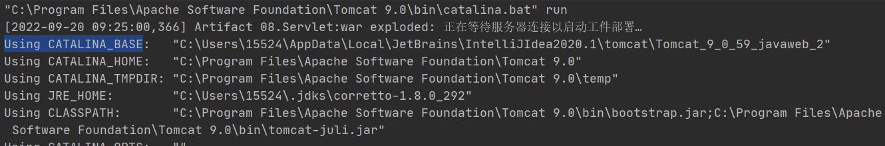
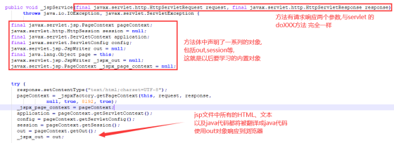
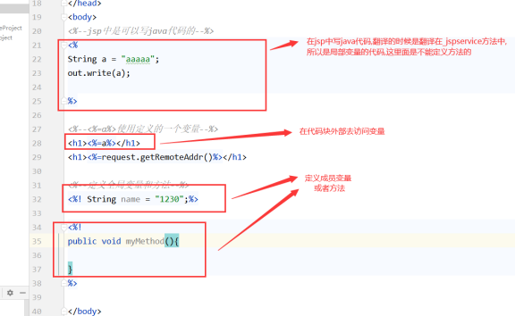
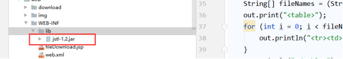
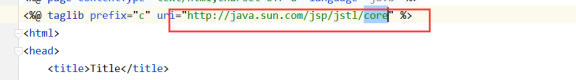
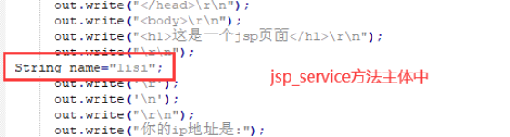
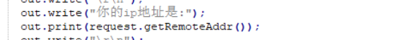
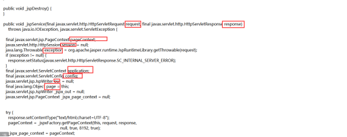
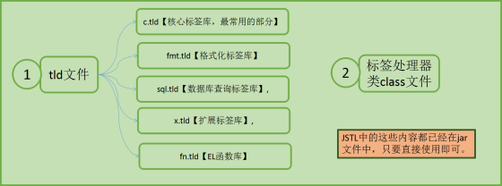

# JSP

### JSP 是什么

JSP，全称 Java Server Page （java 服务端 页面），其实就是 servlet 技术里面的动态页面的实现。

动态页面就意味着，JSP 页面是可以嵌套服务端的 Java 逻辑代码的。

### 为什么需要JSP

前面已经学习了使用 Servlet 对象来构建动态网站页面了，为什么还需要 JSP 呢？

答：就是因为 Servlet 是一个 Java 类，使用 Java 类来构建动态页面，我们的 HTML 的代码只能通过字符串输出！！这样导致，代码难以维护！！

所以在这个情况下。java ee 官方推出了一个类似 HTML 页面的编码方式的动态页面的解决方案。就

是我们现在要学的 JSP。。

是不是Servlet就没啥用了？

Servlet还很有用，可以用来编写控制逻辑，后续会学习

### JSP 运行原理

JSP 本质就是一个 Servlet 类。

可以直接通过 http://localhost:8888/文件名.jsp 访问

访问流程如下:

1. 翻译：Web服务器找到first.jsp，对其进行翻译，生成first_jsp.java文件；其路径在启动服务器时控制台会输出一些信息：

找到图中蓝色代表的路径，在work文件中可以找到当前项目，里面可以找到编译好的jsp文件

2. 编译：服务器将first_jsp.java编译成类文件，翻译和编译的过程遵守Servlet规范，因此说JSP的本质也是Servlet；

3. 实例化并提供服务：服务器实例化类，调用类中的_jspService方法提供服务

打开first_jsp.java，翻译成Java文件后，关键代码是_jspService方法：

在jsp中的<%   ...   %>里面编写的代码是翻译到jspservice方法中的，所以这里只能使用局部变量及调用方法

在jsp中的<!%   ...   %>里面编写的代码则是翻译在成员位置中，所以这里使用的是成员变量及方法

jsp中使用<%=变量名(或调用方法)%>可以直接调用java代码中定义的变量等；需要注意的是调用的方法需要有返回值，否则不行

### 总结

Servlet生成动态页面比较繁琐，使用JSP生成动态页面比较便捷，因为其中的静态内容可以使用HTML生成；

JSP的执行过程是：翻译-编译-实例化-提供服务；

JSP的本质就是Servlet，不过是服务器将JSP进行了翻译和编译；可以说，JSP也是一个Java类

## JSP语法组成

JSP 是动态页面，所以是可以在 JSP 页面编写 Java 的逻辑代码的。

JSP 的 Java 逻辑代码以一下几种方式呈现：

1. 指令，格式为：<%@指令属性=”属性值” %>
2. 代码块,格式为：<% java 代码块 %>
3. 表达式，格式为：<%= 变量或者调用方法%>
4. 动作：是一个标签，格式为：<jsp：动作名       参数名="参数值"></jsp:动作名 >

### JSP三大指令

JSP 指令的作用是，就是用于 JSP 的预处理。

问题：预处理是什么？

答：所谓的预处理，就是用于设置在 JSP 编译之前的参数。让 JSP 解释引擎知道使用什么方式来解释该页面。

#### 1.page指令

常用参数有：

language=“java” ：设置 jsp 使用的服务器语言

pageEncoding=“UTF-8”：设置编译的编码

import=““：导入 java 的类，功能等同 java 类里面的 import 关键字

#### 2.include指令

**在没有编译 JSP 之前**，先合并另外一个 JSP 页面进来，再编译

<%@include file="head.jsp" >

#### 3.taglib指令

标签库导入命令，就是用于导入标签库。

使用第三方的标签库时要用指令导入：

### JSP代码块

使用 JSP 代码块声明了一个变量：

~~~jsp
<% String name="lisi"; %>
//翻译在Servlet类中的service方法体中，是局部的变量;也可以调用方法
~~~

~~~jap
<%! String name = “李四”; %> 
//定义的是成员变量或者方法,翻译在Servlet类中的成员位置上
~~~

#### 总结

JSP java 代码块<% %>是在 jsp_Service方法 里面加代码。所以它只能支持设置代码块

根据Java 语法可知：

1. 方法主体里面是不能在写方法的。所以<% %>不可以声明方法

2. 方法主体是可以写逻辑代码块的，所以<% %>可以写代码块

3. 方法主体的声明的变量，是不可以有修饰符的，所以<% %>声明的变量不可以有修饰符

### JSP表达式

使用表达式输出变量,表达式可以调用方法以及变量，调用的方法必须要有返回值，否则报错

格式为：<%=Java代码%>，例如：

你的ip地址是:<%=request.getRemoteAddr()%>

翻译成的java代码：

### JSP注释

html注释：只能注释html代码片段

jsp注释：推荐使用

<%– –%>：可以注释所有内容

并且使用html注释时html注释内容显示在页面上而JSP 注释不显示

### JSP动作（了解）

JSP 通过动作实现了一些通用的 java 代码。方便我们使用。从而减少我们编写代码的量。

JSP动作提供的功能是很少的。了解就可以。强大的通用代码库我们后面会教JSTL（JSP核心标签库）。

JSP 动作是内置在 JSP 里面的。所以不需要导入就可以使用！

#### 1.跳转标签forward

用于跳转到指定页面

<jsp:forward  page="first.jsp">

跳转使用的是转发

#### 2.包含动作include

包含其他页面进来

<jsp:include  page="head.jsp" ><jsp:include >

#### 问题： JSP 提供的两个包含其他页面的方式<%@include %>和<jsp:include >有什么区别

答：<%@include %>在预编译就包含，页面还没有编译就包含进来了。而后者在运行到这个标签

<jsp:include >才包含进来。其实就是引入其他页面的时间点不同

### 内置对象

创建好的对象,我们直接可以使用

所谓的内置对象，就是 JSP 的代码块（<% %>）里面以及表达式里面<%= %不要 new 就可以直接使用的对象。

为什么内置对象不用 new 就可以使用？

这些隐藏对对象就是 jsp_Service 方法的内部变量。所以我们也是通过查看 jsp 的代码就可以记住了有哪些隐式对象

#### 9大内置对象及4大作用域(面试题)

4大作用域：

page域(pageContext,当前页面)<request(request,一次请求)<session(session,一次会话)<servletContext(application,整个项目)

9大内置对象：

1. request 请求（HttpServletRequest）: 一次请求访问的多个资源(转发)

2. response 响应（HttpServletResponse）: 响应对象

3. session 会话（HttpSession） 一次会话的多个请求间

4. application 上下文（ServletContext） :所有用户间共享数据

5. out （JspWriter，等同 response.getWriter()）,输出对象，数据输出到页面上

6. page（表示本页面对象 this，开发基本用不到）

7. pageContext 用于设置本 JSP 页面数据的作用域（是 JSP 特有的），在 pageContext 设置数据，只能在本页面使用。不是本页面就无效了。

8. config （ServletConfig），用于获得 web.xml 的初始化参数的

9. Exception（Throwable）:代表发生错误的JSP页面中对应的异常对象

内置对象exception比较特殊，默认情况下不存在；只有当JSP中使用指令指定该页面作为错误页面使用时才会翻译生成该内置对象。

~~~jsp
<%@ page contentType="text/html;charset=UTF-8" language="java" isErrorPage="true" %>
~~~

注意：

即使一个页面没有设置isErrorPage=“true”，也可以作为错误页面使用，区别在是否有内置对象exception内置对象产生。

所有的隐藏对象，其实都是放在 pageContext 作用域里面的。所有的隐藏对象都可以通过 pageContext对象获得！

9大对象在生成的位置

# EL表达式

EL是Expression Language的简称，即表达式语言。用于给JSP标签的属性赋值。表达式也可以脱离标签单独使用。

格式: ${EL表达式}

作用: 替换和简化jsp页面中java代码的编写

## EL使用

jsp默认支持el表达式的。如果要忽略el表达式设置jsp中page指令中：isELIgnored="true" 忽略当前jsp页面中所有的el表达式

\ ${表达式} ：忽略当前这个el表达式  (反斜杠后没空格)

### 表达式对运算的支持

• 算数运算符： +    -    *   / (div)     %(mod)

• 比较运算符： > < >= <= == !=

• 逻辑运算符： &&(and) ||(or) !(not)

• 空运算符： empty 功能：用于判断字符串、集合、数组对象是否为null或者长度是否为0

{empty list}:判断字符串、集合、数组对象是否为null或者长度为0，

emptylist:判断字符串、集合、数组对象是否为null或者长度为0

{not empty str}:表示判断字符串、集合、数组对象是否不为null 并且 长度>0

示例：

~~~jsp
<%--获取值--%>
${value}
这里的value的值是从域中去查找的，是不分区域的
会从page域---request域---session域---application域中去查找数据，如果查找到就直接结束。所以如果多个域中存放了相同的变量，则取出的是先查找到的域
~~~

~~~jsp
<%-- 三目运算符--%>
${value==1?"男":"女"}		

<%-- 比较运算符--%>
${3>4}

<%-- 算术运算符--%>
${3 div 4}			//div 和 / 是同一个意思

<%-- 逻辑运算符--%>
${5>4 && 0<1}
${5>4 and 0<1}  	//and和&&一个意思
              
<%-- 三目运算符--%>
${not empty value}
${not empty valueff}  //这里可以乱填，但结果都是false，不存在空指针异常

<%-- 获取值--%>
${value}

<%-- 获取的值是一个对象--%>
${user}			//获取的是地址
${user.name}	//根据属性获取值，不能乱写

<%-- 获取的值是一个集合--%>
${list[1].name}		//只获取一个数据时可以，要遍历数据就使用标签库来遍历。填的数字如果越界，不会报错，但什么都不显示

<%-- 获取的值是map集合--%>
${maps["key"]}		//这样获取的是value值

<%-- 获取不同域的值--%>
${requestScope.名字}	//其他域同理

~~~

### pageContext 对象的支持

el表达式中有11个隐式对象,可以通过pageContext获取jsp其他八个内置对象

| ***\*隐含对象\**** | ***\*描述\****                |
| ------------------ | ----------------------------- |
| pageScope          | page 作用域                   |
| requestScope       | request 作用域                |
| sessionScope       | session 作用域                |
| applicationScope   | application 作用域            |
| param              | Request 对象的参数，字符串    |
| paramValues        | Request对象的参数，字符串集合 |
| header             | HTTP 信息头，字符串           |
| headerValues       | HTTP 信息头，字符串集合       |
| initParam          | 上下文初始化参数              |
| cookie             | Cookie值                      |
| pageContext        | 当前页面的pageContext         |

# JSTL标签库

为了减少 JSP 页面上的 Java 代[码，Java](https://baike.baidu.com/item/标签库/5088969)Sun 官方推出了 JSTL 标签库标准。JSTL 全称为（JavaServer Pages Standard Tag Library，JSP 标准标签库)

使用步骤:

1. 导入jstl相关jar包 或依赖

2. 引入标签库：taglib指令： <%@ taglib profix=" " uri="  " %>

3. 使用标签

## 常用JSTL标签

JSP中的标签库就是用Java类【遵守一定规范，成为标签处理器类】实现动态功能，将这些动态功能在tld文件中描述为标签，在JSP中通过使用标签就可以实现动态功能，不用在JSP中编写复杂的Java代码

具体可以查看 jstl-1.2.jar 里面的 META-INF 的*.tld 文件

#### if标签

~~~jsp
<%@ page contentType="text/html;charset=UTF-8" language="java" %>
<%-- prefix的值就是为下面使用标签起一个名字    uri--%>
<%@ taglib prefix="c" uri="http://java.sun.com/jsp/jstl/core" %>
<!DOCTYPE>
<html>
<head>
    <title>Title</title>
</head>
<body>
<%-- test是必须的属性--%>
<c:if test="true">	<%-- test就是if括号的参数--%>
    <h1>正确</h1>
</c:if>
    
<c:if test="false">
    <h1>错误</h1>
</c:if>

</body>
</html>
~~~

~~~jsp
<%@ page contentType="text/html;charset=UTF-8" language="java" %>
<%-- prefix的值就是为下面使用标签起一个名字    uri--%>
<%@ taglib prefix="c" uri="http://java.sun.com/jsp/jstl/core" %>
<!DOCTYPE>
<html>
<head>
    <title>Title</title>
</head>
<body>
<%
    request.setAttribute("age", 15);
%>

<c:if test="${age>=15}">
    <h1>正确</h1>
</c:if>
<%--是没有else的，只能继续使用if--%>
<c:if test="${age<15}">
    <h1>错误</h1>
</c:if>

</body>
</html>
~~~

#### Set标签

用于声明一个变量到作用域里面
var ：指定变量名（key）
value: 指定值
scope:指定作用域 默认是page。作用域参数分别为page，request，session，application

propery：设置对象的属性值
target：设置创建对象的类名

~~~jsp
<c:set var="strs" value="1,5,65,45,25,aaa" scope="request"></c:set>
~~~

功能等同于pageContext.setAttribute("strs","1,2,3,abc,ddd,ece")

#### choose标签

~~~jsp
<%--choose其实就是switch--%>
<c:set var="number" value="5" scope="page"></c:set>
<c:choose>
    <c:when test="${number==1}">星期一</c:when>
    <c:when test="${number==2}">星期二</c:when>
    <c:when test="${number==3}">星期三</c:when>
    <c:when test="${number==4}">星期四</c:when>
    <c:when test="${number==5}">星期五</c:when>
    <c:when test="${number==6}">星期六</c:when>
    <c:when test="${number==7}">星期日</c:when>
</c:choose>
~~~

#### forEach标签

items：用于设置循环遍历的集合、数组

var:用于设置每次循环返回的数据接收的变量名。该变量是放在 pageScope

begin=““:用于设置循环的开始位置

end=““：用于设置循环的结束位置

step=“” ：用于设置步长，默认1，就是跳几个来遍历

varStatus=““：用于获得循环的状态

~~~jsp
<c:forEach items="${list}" var="user" varStatus="s">
    <%-- s.count就是获取当前循环的次数--%>
    ${user.name}------${user.age} ------ ${s.count} 
</c:forEach>
~~~

#### 格式化标签

~~~jsp
<%@ taglib prefix="f" uri="http://java.sun.com/jsp/jstl/fmt" %>
<%--fmt标签库，注意要导上面这个包--%>
<%
    request.setAttribute("avg", 25.2222);
    request.setAttribute("birthday", new Date());
%>

<%--数字保留两位小数--%>
<%-- patten是模板，maxFractionDigits才是小数的位数；格式化时会四舍五入--%>
<f:formatNumber type="number" value="${avg}" pattern="0.00" maxFractionDigits="2"></f:formatNumber>

<%--时间格式化--%>
<f:formatDate value="${birthday}" pattern="yyyy-MM-dd HH:mm:ss"></f:formatDate>

<%--百分比--%>
<f:formatNumber value="0.22226" type="percent"></f:formatNumber>
~~~

