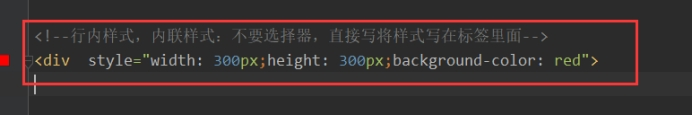

# CSS

# css介绍

1. css是什么 

是美化html的

CSS 指层叠样式表 (Cascading Style Sheets)

* 样式定义如何显示 HTML 元素

* 样式通常存储在样式表中

* 把样式添加到 HTML 4.0 中，是为了解决内容与表现分离的问题

* 外部样式表可以极大提高工作效率

* 外部样式表通常存储在 CSS 文件中

* 多个样式定义可层叠为一

 

2. css作用

1. 样式表解决了html的内容与表现分离

2. 使用样式表极大的提高了工作效率。

 

3. css书写规则 

* 基本语法 

Css规则主要由两部分组成 1.选择器 2.一条或多条声明

选择器主要作用是为了确定需要改变样式的HTML元素

每一条声明由一个属性和一个值组成，使用花括号来包围声明，属性与值之间使用冒号(:)分开

如图:

 

 

* 书写注意事项

1. 如果值为若干单词，则要给值加引号

2. 多个声明之间使用分号(;)分开

3. **css对大小写不敏感,如果涉及到与html文档一起使用时，class与id名称对大小写敏感**

# css样式引入的三种方式

## 内联样式表

要使用内联样式，你需要在相关的标签内使用样式（style）属性。Style 属性可以包含任何 CSS 属性

例如:

这是一个DIV
 

​	注意:慎用这种方式，它将内容与显示混合在一起，损失了样式表的优势。一般情况下，这种方式只有在一个标签上只应用一次样式时才会使用

 

 

## 内部样式表

我们可以使用
</head>
<body>

第一段文字

第一段文字span

第二段文字

    我的div1
    

        BBBBBBBBBBBBBBBBBBBBBBBBBB
        
divAAAAAAAAAAAAAAAA

        
divAAAAAAAAAAAAAAAA

        
divAAAAAAAAAAAAAAAA

        
divAAAAAAAAAAAAAAAA

    

我的div2

我的div2

我的div2

我的div2

 
 
span中的文字
</body>
</html>
~~~

## 后代选择器

|  |
| ------------------------------------------------------------ |
|  |

~~~html
div p{
	color:red;
}

如果是这个选择器，则1,2都会变成红色
~~~

## 直接后代选择器

加了>表示只有直接后代生效

## 相邻兄弟选择器

只有下面相邻的标签生效，上面相邻的无效

# 伪类

css伪类用于向某些选择器添加特殊效果。

下面我们介绍一下锚伪类。

​	在支持css的浏览器中，链接的不同状态都可以不同的方式显示，这些状态包括：活动状态，已被访问状态，未被访问状态，和鼠标悬念状态。

active点击时进行的操作

# css属性

## 字体

Css字体属性定义文本的字体系列，大小，加粗，风格(如斜体)和变形(如小型大写字母)

常用属性:

* font:简写属性，作用是把所有针对字体的属性设置在一个声明中。

* font-family:定义字体系列

* font-size:定义字体的尺寸

* font-style:定义字体风格
* 也能一次性写：选择器 { font: font-style  font-weight  font-size/line-height  font-family;}不一定四个都写

~~~html
<html lang="en">
<head>
    <meta charset="UTF-8">
    <title>字体属性</title>
    
</head>
<body>

锄禾日当午，汗滴禾下土

锄禾日当午，汗滴禾下土

锄禾日当午，汗滴禾下土

</body>
</html>
~~~

## 文本

CSS 文本属性可定义文本的外观。通过文本属性，您可以改变文本的颜色、字符间距，对齐文本，装饰文本，对文本进行缩进，等等。

常用属性

* color:定义文本颜色

* text-align:定义文本对齐方式

* letter-spacing:定义字符间隔

* word-spacing:定义字符之间空格的长度，如果没有空格则没有效果

* text-decoration：是否加下划线。无：none;  有：underline;

## 背景

CSS 允许应用纯色作为背景，也允许使用背景图像创建相当复杂的效果。CSS 在这方面的能力远远在 HTML 之上。

常用属性:

* background:简写属性，作用是将背景属性设置在一个声明中

* background-color:定义背景颜色

* background-image:定义背景图片。这个和在body里定义一个img标签展示出的图片不一样。内容会盖在背景上

* background-position:定义背景图片的起始位置

* background-repeat:定义背景图片是否及如何重复。当图片原始大小不足以铺满页面时，会自动重复图片以铺满页面

## 尺寸

CSS 尺寸 (Dimension) 属性允许你控制元素的高度和宽度。

常用属性:

* width:设置元素的宽度

* height:设置元素的高度	

## 列表

CSS 列表属性允许你放置、改变列表项标志，或者将图像作为列表项标志。

常用属性:

* list-style:简写属性。用于把所有用于列表的属性设置于一个声明中。

* list-style-image:定义列表项标志为图象

* list-style-position:定义列表项标志的位置

* list-style-type:定义列表项标志的类型。

## 表格

CSS 表格属性可以帮助您极大地改善表格的外观

​	 常用属性:

* border-collapse:定义是否把表格边框合并为单一的边框。

* border-spacing:定义分隔单元格边框的距离

* caption-side:定义表格标题的位置

## 轮廓

和边框类似

轮廓（outline）是绘制于元素周围的一条线，位于边框边缘的外围，可起到突出元素的作用。

CSS outline 属性规定元素轮廓的样式、颜色和宽度。

常用属性:

* outline:在一个声明中设置所有的轮廓属性

* outline-color:定义轮廓的颜色

* outline-style:定义轮廓的样式

* outline-width:定义轮廓的宽度

## 定位（重要）

CSS 定位 (Positioning) 属性允许你对元素进行定位。

定位就是将控件固定放在指定的位置，遵循，子绝父相的原则，子要想绝对定位，父就要相对定位，父是绝对还可以一直往上找

定位的基本思想很简单，它允许你定义元素框相对于其正常位置应该出现的位置，或者相对于父元素、另一个元素甚至浏览器窗口本身的位置

CSS 有三种基本的定位机制：普通流、浮动和绝对定位。

常用属性:

* position:把元素放置到一个静态的,相对的，绝对的，或固定的位置中。

* top:定义了定位元素的上外边距边界与其包含块上边界之间的偏移量

* right: 定义了定位元素右外边距边界与其包含块右边界之间的偏移

* left: 定义了定位元素左外边距边界与其包含块左边界之间的偏移

* bottom: 定义了定位元素下外边距边界与其包含块下边界之间的偏移

## 分类

CSS 分类属性允许你控制如何显示元素，设置图像显示于另一元素中的何处，相对于其正常位置来定位元素，使用绝对值来定位元素，以及元素的可见度。

 常用属性

* clear:取消浮动

* float:定义元素在哪个方向浮动。解析的时候是从上到下的顺序来浮动标签

* cursor:当指向某元素之上时显示的指针类型。指定鼠标类型当鼠标经过时显示

* display:定义是否及如何显示元素。隐藏后不占空间

* visibility:定义元素是否可见或不可见。隐藏后占空间

# CSS框模型

## 盒子模型

CSS 框模型 (Box Model) 规定了元素框处理元素内容、[内边距](http://www.w3school.com.cn/css/css_padding.asp)、[边框](http://www.w3school.com.cn/css/css_border.asp) 和 [外边距](http://www.w3school.com.cn/css/css_margin.asp) 的方式。

元素框的最内部分是实际的内容，直接包围内容的是内边距。内边距呈现了元素的背景。内边距的边缘是边框。边框以外是外边距，外边距默认是透明的，因此不会遮挡其后的任何元素

## 边框

元素的边框 (border) 是围绕元素内容和内边距的一条或多条线。

CSS border 属性允许你规定元素边框的样式、宽度和颜色。

 			常用属性:

* border:简写属性，用于把针对于四个边的属性设置在一个声明。

* border-color:简写属性，定义元素边框中可见部分的颜色，或为四个边分别设置颜色。

* border-style:用于定义所有边框的样式，或者单独为各边设置边框样式。

* border-width:简写属性，用于为元素的所有边框设置宽度，或则单独地为各边边框设置宽度

* border-top:简写属性，用于把上边框的所有属性设置到一个声明中

* border-right:简写属性，用于把右边框所有属性设置到一个声明中

* border-bottom:简写属性，用于把下边框的所有属性设置到一个声明中

* border-left:简写属性，用于把左边框的所有属性设置到一个声明中。

 

## 外边距

围绕在元素边框的空白区域是外边距。设置外边距会在元素外创建额外的“空白”。

设置外边距的最简单的方法就是使用 margin 属性，这个属性接受任何长度单位、百分数值甚至负值。

常用属性:

* margin:简写属性，在一个声明中设置所有外边距属性

* margin-top:定义元素的上外边距

* margin-right:定义元素的右外边距

* margin-bottom:定义元素的下外边距

* margin-left定义元素的左外边距

注意:在使用margin来定义所有外边距时，可以使用值复制。

* 如果缺少左外边距的值，则使用右外边距的值。

* 如果缺少下外边距的值，则使用上外边距的值。

* 如果缺少右外边距的值，则使用上外边距的值。

 

 

## 内边距

元素的内边距在边框和内容区之间。控制该区域最简单的属性是 padding 属性。

CSS padding 属性定义元素边框与元素内容之间的空白区域。

常用属性:

* padding:简写属性，作用是在一个声明中设置元素的所有内边距属性

* padding-top:定义元素的上内边距

* padding-right:定义元素的右内边距

* padding-bottom:定义元素的下内边距

* padding-left:定义元素的左内边距。

