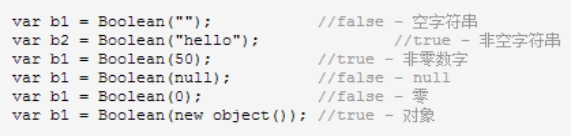
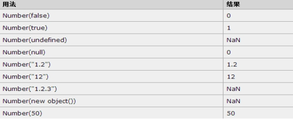
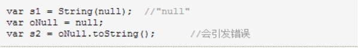
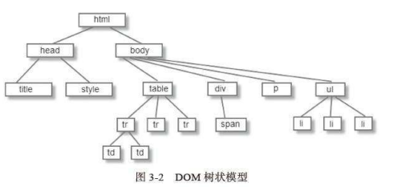

# JavaScript

简称：js 

javascript和js有什么区别？Java和javascript有什么区别?

javascript简称为js就是同一个

Java和javascript没有关系；

 

Js:就是动态去操作html和css

JavaScript是基于对象模型和事件驱动的脚本语言，可以嵌入到html中

特点：

1. 交互性

2. 安全性：js不能访问本地磁盘

3. 跨平台性：所有的浏览器都内置的js解析器，也就所有浏览器都支持js语言

## JavaScript概述

javaScript 是因特网上最流行的脚本语言，它存在于全世界所有 Web 浏览器中，能够增强用户与 Web 站点和 Web 应用程序之间的交互。

脚本语言：脚本语言又被称为扩建的语言，或者动态语言，是一种解释型语言，由解释器来运行，用来控制软件应用程序，脚本通常以文本保存，只在被调用时进行解释或编译。

JavaScript 是可插入 HTML 页面的编程代码。

JavaScript 插入 HTML 页面后，可由所有的现代浏览器执行。

JavaScript 与 Java 是两种完全不同的语言

 

**脚本语言: 缩短传统的编写-编译-链接-运行过程,解释运行而非编译运行**

 

 

**JS的常见用途**

* HTML DOM操作（节点操作，比如添加、修改、删除节点）

* 给HTML网页增加动态功能，比如动画

* 事件处理：比如监听鼠标点击、鼠标滑动、键盘输入

入门练习：

~~~html
<!DOCTYPE html>
<html lang="en">
<head>
    <meta charset="UTF-8">
    <title>js入门</title>
</head>
<body>

<!--不是只有超链接和按钮才有点击事件，基本上都有-->

<button onclick="test1()">按钮1</button>

<button id="but2">按钮2</button>

</body>

</html>
~~~

练习：

按一下按钮，换一张div里的背景图片

~~~html
<!DOCTYPE html>
<html lang="en">
<head>
    <meta charset="UTF-8">
    <title>练习</title>
</head>
<body>

</body>

</html>
~~~

## JavaScript组成部分

**ECMAScript**:它是JS语言的标准,规定了JS的编程语法和基础核心知识

**DOM**: document object model 文档对象模型,提供给JS很多操作页面中元素的属性和方法

**BOM**: browser object model 浏览器对象模型 ,提供了很多操作浏览器 的属性方法,而这些方法都存放在window浏览器对象上

## JS基础

### 定义规范

~~~html
!DOCTYPE html>
<html lang="en">
<head>
    <meta charset="UTF-8">
    <title>Title</title>

</head>

<body>

</body>
<!--js代码区域，js代码理论上写在哪里都可以，但是如果有关系到页面加载的时候，不能影响页面加载
因为页面显示一般都是在body里面，所以，开发中建议将js代码写在body外面，html标签里面
-->

</html>
~~~

### JS的几种引入方式

~~~html
<!DOCTYPE html>
<html lang="en">
<head>
    <meta charset="UTF-8">
    <title>js引入的几种方式</title>
    <!--    第二种，引入外部的js文件-->
    
</head>
<body>
<!--第三种，写在标签内-->
<button onclick="alert('标签内')">666</button>

</body>
<!--第一种，写在html页面中-->

</html>
~~~

## JS基本语法

### 变量声明

变量是用于存储信息的容器

javascript中的变量与我们在java中的变量一样。

在javascript中使用用 var 运算符（variable 的缩写）加变量名定义的

​		JavaScript 变量名称的规则：

变量对大小写敏感（**y** 和 **Y** 是两个不同的变量） 

变量必须以**字母或下划线开始** 

注意：由于 JavaScript 对大小写敏感，变量名也对大小写敏感。

### 基础语法

#### 数据类型

在ECMAScript中，变量可以存在两种数据类型，即原始类型与引用类型。

##### **原始类型**：

可以理解成是一个值类型。简单说，就是一个字面值，它是不可变的，例如: 10  “abc”

​     ECMAScript有五种原始类型

* string  在javascript中字符串字符串字面值，可以使用单引号或双引号声明。

* number 在javascript中任何数字都看成是Number类型，它即可以表示32位整数，也可以表示64位浮点数。八进制首数字必须是0,十六进制使用0x开始。

* boolean 它有两个值true和false.

* undefined:该类型只有一个值undefined.表示的是未初始化的变量

* null 该类型只有一个值null,表示尚未存在的对象。值undefined实际上是从值null派生出来的。因此null==undefined得到的结果是true.

使用typeof判断运算符对变量或值进行判断，会有如下的返回值：

* undefined - 如果变量是 Undefined 类型的

* boolean - 如果变量是 Boolean 类型的

* number - 如果变量是 Number 类型的

* string - 如果变量是 String 类型的

* object - 如果变量是一种引用类型或 Null 类型的

为什么typeof运算符对于 null 值会返回 "Object"。这实际上是 JavaScript 最初实现中的一个错误，然后被 ECMAScript 沿用了。现在，null 被认为是对象的占位符，从而解释了这一矛盾，但从技术上来说，它仍然是原始值。

例子：

console.log()可以输出内容到控制台，注意是浏览器中的控制台

~~~html5
<!DOCTYPE html>
<html lang="en">
<head>
    <meta charset="UTF-8">
    <title>js原始数据</title>
</head>
<body>

</body>

</html>
~~~

##### 引用类型

引用类型通常叫做类(class),也就是说，遇到引用值，所处理的就是对象。

从传统意义上来说，ECMAScript 并不真正具有类。（es6之后有）

ECMAScript 定义了“对象定义”，逻辑上等价于其他程序设计语言中的类。

对象是由 new 运算符加上要实例化的对象的名字创建的

var obj=new Object();

Object对象自身用处不大，但是 ECMAScript 中的 Object 对象与 Java 中的 java.lang.Object 相似，ECMAScript 中的所有对象都由这个对象继承而来，Object 对象中的所有属性和方法都会出现在其他对象中

常用的javascript对象有 Boolean,Number,Array,String,Date,Math,RegExp.类似于java的常用类

可以使用instanceof运算符来判断**对象**的类型。

例子：

~~~html5

~~~

#### == 和 === 的区别 面试题

~~~html5

~~~

#### 类型转换

ECMAScript为开发者提供了大量的类型转换方法。

大部分类型具有进行简单转换的方法，还有几个全局方法可以用于更复杂的转换。

Boolean 值、数字和字符串的原始值它们是伪对象，这意味着它们实际上具有属性和方法。

* 转换成字符串

toString()方法.

* 转换成数字

ECMAScript 提供了两种把非数字的原始值转换成数字的方法，即 parseInt() 和 parseFloat()。前者把值转换成整数，后者把值转换成浮点数。只有对 String 类型调用这些方法，它们才能正确运行；对其他类型返回的都是 NaN。

~~~html5

~~~

* 强制类型转换

使用强制类型转换可以访问特定的值。

ECMAScript 中提供了三种强制类型转换：

1. 把给定的值转换成Boolean类型

2. 把给定的值转换成数字

3. 把给定的值转换成字符串

 

​				

测试Boolean型的强制类型转换

 

测试强制转换成数字类型

测试强制转换成字符串

#### 运算符与表达式

* 一元运算符

++  自加  --自减 

~~~html
<!DOCTYPE html>
<html lang="en">
<head>
    <meta charset="UTF-8">
    <title>js运算符</title>
</head>
<body>

<button onclick="sub()">-
</button>
<input type="text" width="40px" height="20px" value="0" id="input">
<button onclick="add()">+</button>

</body>

</html>
~~~

void运算符

void 运算符对任何值返回 undefined。该运算符通常用于避免输出不应该输出的值，例如，从 HTML 的 <a> 元素调用 JavaScript 函数时。要正确做到这一点，函数不能返回有效值，否则浏览器将清空页面，只显示函数的结果。例如：

~~~html
<a href="javascript:window.open('about:blank')">Click me</a>
~~~

如果把这行代码放入 HTML 页面，点击其中的链接，即可看到屏幕上显示 "[object]"。这是因为 window.open() 方法返回了新打开的窗口的引用。然后该对象将被转换成要显示的字符串

要避免这种效果，可以用 void 运算符调用 window.open() 函数：

~~~html
<a href="javascript:void(window.open('about:blank'))">Click me</a>
~~~

这使 window.open() 调用返回 undefined，它不是有效值，不会显示在浏览器窗口中。

提示：请记住，没有返回值的函数真正返回的都是 undefined。

* 逻辑运算符

逻辑运算符有三种 NOT  AND  OR

在学习各种逻辑运算符之前，让我们先了解一下 ECMAScript-262 v5 规范中描述的 ToBoolean（转换成Boolean类型） 操作。

 

| **参数类型** | **结果**                                                |
| ------------ | ------------------------------------------------------- |
| Undefined    | false                                                   |
| Null         | false                                                   |
| Boolean      | 结果等于输入的参数（不转换）                            |
| Number       | 如果参数为 +0, -0 或 NaN，则结果为 false；否则为 true。 |
| String       | 如果参数为空字符串，则结果为 false；否则为 true。       |
| Object       | true                                                    |

 

* 逻辑NOT运算符

* 如果运算数是对象，返回 false

* 如果运算数是数字 0，返回 true

* 如果运算数是 0 以外的任何数字，返回 false

* 如果运算数是 null，返回 true

* 如果运算数是 NaN，返回 true

* 如果运算数是 undefined，发生错误

 

* 逻辑AND运算符 （就是and）

| ***\*运算数 1\**** | ***\*运算数 2\**** | ***\*结果\****  |
| ------------------ | ------------------ | --------------- |
| ***\*true\****     | ***\*true\****     | ***\*true\****  |
| ***\*true\****     | ***\*false\****    | ***\*false\**** |
| ***\*false\****    | ***\*true\****     | ***\*false\**** |
| ***\*false\****    | ***\*false\****    | ***\*false\**** |

 

* 逻辑OR运算符 （就是or）

| ***\*运算数 1\**** | ***\*运算数 2\**** | ***\*结果\****  |
| ------------------ | ------------------ | --------------- |
| ***\*true\****     | ***\*true\****     | ***\*true\****  |
| ***\*true\****     | ***\*false\****    | ***\*true\****  |
| ***\*false\****    | ***\*true\****     | ***\*true\****  |
| ***\*false\****    | ***\*false\****    | ***\*false\**** |

 

 

 

* 加性运算符

某个运算数是 NaN，那么结果为 NaN。

-Infinity 加 -Infinity，结果为 -Infinity。

Infinity 加 -Infinity，结果为 NaN。

+0 加 +0，结果为 +0。

-0 加 +0，结果为 +0。

-0 加 -0，结果为 -0。  有+为+

不过，如果某个运算数是字符串，那么采用下列规则：

如果两个运算数都是字符串，把第二个字符串连接到第一个上。

如果只有一个运算数是字符串，把另一个运算数转换成字符串，结果是两个字符串连接成的字符串。

 

* 关系运算符

关系运算符有>(大于),<(小于) >=(大于等于) <=(小于等于) ,它们的运算结果返回的是一个boolean值。

* 常规比较

* 如果是数学，那么比较与我们在java中操作一样。

* 如果是两个字符串使用关系运算符操作，那么我们可以简单理解成是按照字母的码值来比较。比较容易理解的是根据字母顺序，在前的字母比在后的小，所有的小写字母都大于大写字母。

* 比较数字或字符串

* 如果两个数字字符串比较，例如:”23”<”3”,它们也是按照数字在码表中的码值来比较.

* 如果一个是数字一个是字符串，那么会将字符串转换成数字在进行比较。	

 

* 等性运算符

ECMAScript提供了两套等性运算符：等号与非等号用来处理原始值，全等号与非全等号来处理对象。

 

执行类型转换的规则如下：

* 如果一个运算数是 Boolean 值，在检查相等性之前，把它转换成数字值。false 转换成 0，true 为 1。

* 如果一个运算数是字符串，另一个是数字，在检查相等性之前，要尝试把字符串转换成数字。

* 如果一个运算数是对象，另一个是字符串，在检查相等性之前，要尝试把对象转换成字符串。

* 如果一个运算数是对象，另一个是数字，在检查相等性之前，要尝试把对象转换成数字。

在比较时，该运算符还遵守下列规则：

* 值 null 和 undefined 相等。

* 在检查相等性时，不能把 null 和 undefined 转换成其他值。

* 如果某个运算数是 NaN，等号将返回 false，非等号将返回 true。

* 如果两个运算数都是对象，那么比较的是它们的引用值。如果两个运算数指向同一对象，那么等号返回 true，否则两个运算数不等。

全等号由三个等号表示（===），只有在无需类型转换运算数就相等的情况下，才返回 true。

非全等号由感叹号加两个等号（!==）表示，只有在无需类型转换运算数不相等的情况下，才返回 true。

 

 

* 三元运算符

在js中也存在三元运算符，与java中使用方式一样。例如:

var max = (num1 > num2) ? num1 :num2;

这个表达式描述的就是如果num1大于num2，那么max的值就是num1,返回之max的结果就是num2.

 ~~~html
 <!DOCTYPE html>
 <html lang="en">
 <head>
     <meta charset="UTF-8">
     <title>三目运算符</title>
 </head>
 <body>
 
性别：

 <button onclick="fun1(1)">男</button>
 <button onclick="fun1(0)">女</button>
 </body>
 
 </html>
 ~~~

* 赋值运算符

简单的赋值运算符由等号（=）实现，只是把等号右边的值赋予等号左边的变量

 

每种主要的算术运算以及其他几个运算都有复合赋值运算符：

乘法/赋值（*=）

除法/赋值（/=）

取模/赋值（%=）

加法/赋值（+=）

减法/赋值（-=）

 

* 逗号运算符

用逗号运算符可以在一条语句中执行多个运算。例如:

var a=1,b=2,c=3;

#### 流程控制

条件、循环、判断都和java一样。

练习：在页面中输出九九乘法表

~~~html
<!DOCTYPE html>
<html lang="en">
<head>
    <meta charset="UTF-8">
    <title>九九乘法表</title>
    
</head>
<body>

</body>

</html>
~~~

## js函数

Js 中定义函数：

语法：

function 方法名(参数名字....){

函数体;

}

注意：

Js中的函数的参数是不需要定义类型的，只用名字：

调用时会自动识别参数，有参数的函数，调用的时候，根据自己的需求给具体的值，如果没有也可以不写,则这个参数值是：NaN

甚至调用一个参数的函数时可以传入多个参数

 

有返回值的函数：

 

js不需要指定返回值类型，自动识别

 

完整代码：

~~~html
<!DOCTYPE html>
<html lang="en">
<head>
    <meta charset="UTF-8">
    <title>Title</title>
</head>
<body>
<input type="text" id="input1">
<button onclick="click1();">按钮</button>

</body>

</html>
~~~

## DOM

DOM文档对象模型(Document Object Model)

DOM 为文档提供了结构化表示，并定义了如何通过脚本来访问文档结构。 目的其实就是为了能让js操作html元素而制定的一个规范。

~~~html
//获取整个网页的document对象
    console.log(document);

    //获取网页中document的所有子节点
    console.log(document.childNodes);
~~~

### JS操作DOM

【介绍】：其实我们要操作DOM非常简单，直接使用document对象即可！！

Document内置对象（直接使用）的作用:

1)往网页中写入一些标签

2)可以动态获取网页中所有的标签(节点)

3)可以对获取到的标签进行CRUD

### js创建对象

~~~html
<!DOCTYPE html>
<html lang="en">
<head>
    <meta charset="UTF-8">
    <title>创建对象</title>
</head>
<body>

</body>

</html>
~~~

### 动态写入内容

~~~html
< ! DOCTYPE html>
<html lang="en">
<head>
	<meta charset="UTF-8">
    <title>Title</title>
</head>
<body>
</body>

</html>
~~~

### DOM动态获取标签

| ***\*函数名\****                          | ***\*含义\****            |
| ----------------------------------------- | ------------------------- |
| ***\*document.getElementById\****         | 根据id获取一个标签(元素)  |
| ***\*document.getElementsByTagName\****   | 根据标签名称获取多个标签  |
| ***\*document.getElementsByClassName\**** | 根据class名称获取多个标签 |
| **document.getElementsByName**            | 根据name名称获取多个标签  |

~~~html
<!DOCTYPE html>
<html lang="en">
<head>
    <meta charset="UTF-8">
    <title>Title</title>
</head>
<body>
<!--id不能重名-->
<button id="but1">按钮1</button>
<button name="but2">按钮2</button>
<button name="but2">按钮3</button>
<button class="but3">按钮4</button>
<button class="=but3">按钮5</button>
<button>按钮6</button>
<button>按钮7</button>
<button>按钮8</button>
</body>

</html>
~~~

### js中的常见事件

**系统内置事件**

* Window.onload  网页加载完毕事件

* Window.onscroll 网页滚动加载事件

* Window.onresize 网页尺寸切换事件

~~~html
<!DOCTYPE html>
<html lang="en">
<head>
    <meta charset="UTF-8">
    <title>Title</title>
</head>
<body>

</body>

</html>
~~~

**dom标签中的常用事件**

* 鼠标点击事件  onclick事件

* 鼠标移入事件  onmouseover

* 鼠标离开事件  onmouseout

* 鼠标移动事件  onmousemove 

~~~html
<!DOCTYPE html>
<html lang="en">
<head>
    <meta charset="UTF-8">
    <title>鼠标事件</title>
</head>
<body>

 

</body>

</html>
~~~

### dom案例实战

#### 切换图片案例：

~~~html
<!DOCTYPE html>
<html lang="en">
<head>
    <meta charset="UTF-8">
    <title>切换图片</title>
</head>
<body>

 
<button>切换</button>

</body>

</html>
~~~

#### 切换显示隐藏案例：

~~~html
<!DOCTYPE html>
<html lang="en">
<head>
    <meta charset="UTF-8">
    <title>Title</title>
</head>
<body>

6666666

<button>隐藏</button>
</body>

</html>
~~~

#### 网页换肤效果

~~~html
<!--<!DOCTYPE html>-->
<!--<html lang="en">-->
<!--<head>-->
<!--    <meta charset="UTF-8">-->
<!--    <title>换肤</title>-->
<!--    -->
<!--</head>-->
<!--<body>-->
<!--
-->
<!--    -->
<!--    -->
<!--    -->
<!--    -->
<!--    -->
<!--
-->
<!--
-->

<!--
-->
<!--</body>-->
<!---->
<!--</html>-->

<!--另外一种方式-->
<!DOCTYPE html>
<html lang="en">
<head>
    <meta charset="UTF-8">
    <title>换肤</title>
    
</head>
<body>

    <!--    将id传进去-->
    
    
    
    
    

</body>

</html>
~~~

#### 全选、反选、全不选

~~~html
<!DOCTYPE html>
<html lang="en">
<head>
    <meta charset="UTF-8">
    <title>全选全不选反选</title>
</head>
<body>
<h1>歌曲排行榜</h1>

<input type="checkbox">1.老鼠爱大米  
<input type="checkbox">2.香水有毒 
<input type="checkbox">3.求佛 
<input type="checkbox">4.爱你 
<input type="checkbox">5.东风破 
<input type="checkbox">6.稻香 

<button>全选</button>
<button>全不选</button>
<button>反选</button>
</body>

</html>
~~~

#### 隔行换色

~~~html
<!DOCTYPE html>
<html lang="en">
<head>
    <meta charset="UTF-8">
    <title>隔行变色+移入变色，移除还原</title>
    
</head>
<body>
<table align="center">
    <tr>
        <td>序号</td>
        <td>姓名</td>
        <td>性别</td>
        <td>手机号</td>
        <td>邮箱</td>
    </tr>
    <tr>
        <td>1</td>
        <td>小明</td>
        <td>男</td>
        <td>1346885456</td>
        <td>6545866665@qq.com</td>
    </tr>
    <tr>
        <td>2</td>
        <td>小明</td>
        <td>男</td>
        <td>1346885456</td>
        <td>6545866665@qq.com</td>
    </tr>
    <tr>
        <td>3</td>
        <td>小明</td>
        <td>男</td>
        <td>1346885456</td>
        <td>6545866665@qq.com</td>
    </tr>
    <tr>
        <td>4</td>
        <td>小明</td>
        <td>男</td>
        <td>1346885456</td>
        <td>6545866665@qq.com</td>
    </tr>
    <tr>
        <td>5</td>
        <td>小明</td>
        <td>男</td>
        <td>1346885456</td>
        <td>6545866665@qq.com</td>
    </tr>

</table>
</body>

</html>
~~~

#### tab选项卡

~~~html
<!DOCTYPE html>
<html lang="en">
<head>
    <meta charset="UTF-8">
    <title>tab选项卡</title>
    
</head>
<body>

    

        <table>
            <tr>
                <td style="background-color: white"><a href="#">新闻</a></td>
                <td><a href="#">论坛</a></td>
                <td><a href="#">公益</a></td>
                <td><a href="#">安全</a></td>
            </tr>
        </table>
    

    

        <ol style="display: block">
            <li>新闻111111</li>
            <li>新闻111111</li>
            <li>新闻111111</li>
            <li>新闻111111</li>
        </ol>
        <ol>
            <li>论坛222222</li>
            <li>论坛222222</li>
            <li>论坛222222</li>
            <li>论坛222222</li>
        </ol>
        <ol>
            <li>公益333333</li>
            <li>公益333333</li>
            <li>公益333333</li>
            <li>公益333333</li>
        </ol>
        <ol>
            <li>安全444444</li>
            <li>安全444444</li>
            <li>安全444444</li>
            <li>安全444444</li>
        </ol>
    

</body>

</html>
~~~

#### 轮播图

##### 单次定时器

setTimeout

清除：clearTimeout

~~~html
<!DOCTYPE html>
<html lang="en">
<head>
    <meta charset="UTF-8">
    <title>单次定时器</title>
</head>
<body>
<button id="but1">清空定时器</button>
</body>

</html>
~~~

##### 多次定时器

setInterval

清除： clearInterval

~~~html
<!DOCTYPE html>
<html lang="en">
<head>
    <meta charset="UTF-8">
    <title>多次定时器</title>
</head>
<body>

<button onclick="fun1()">清空</button>
</body>

</html>
~~~

##### 简易轮播图

~~~html
<!DOCTYPE html>
<html lang="en">
<head>
    <meta charset="UTF-8">
    <title>简易轮播图</title>
    
</head>
<body>

    

    

    

    

    

</body>

</html>
~~~

#### 广告倒计时

~~~html
<!DOCTYPE html>
<html lang="en">
<head>
    <meta charset="UTF-8">
    <title>广告倒计时</title>
    
</head>
<body>

    

        倒计时：
         5
        <a href="#" onclick="fun2()"> 跳过广告</a>
    

</body>

</html>
~~~

## js时间格式问题

~~~html
<!DOCTYPE html>
<html lang="en">
<head>
    <meta charset="UTF-8">
    <title>js时间格式问题</title>
</head>
<body>

</body>

</html>
~~~

## js中几种定义变量的区别

### var

定义一个var变量，在js中可以重复定义同一个，但会发生覆盖。类似全局变量

### let

属于块级作用域，有作用范围。类似于局部变量，不可以重复定义，运行时报错。不同的作用域可以定义相同的变量

### console

类似于常量，不能重复定义（编译不报错，运行报错）；定义后值不能改变
