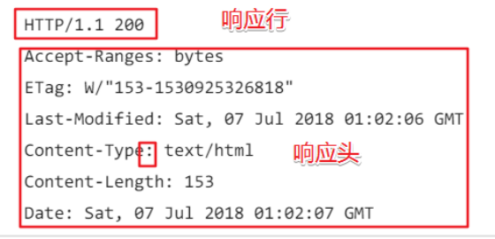
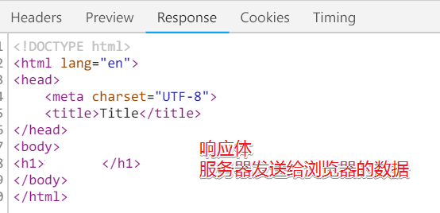
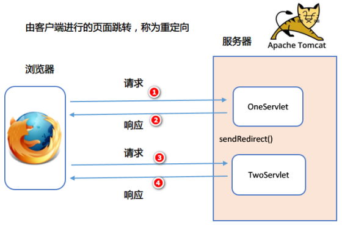
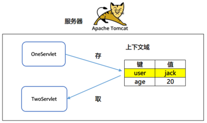

# Request

# Response

## HTTP响应概述

从服务器端发送的所有数据给浏览器，这些数据被封装成一个对象，这个对象称为响应对象

在JavaEE中ServletResponse父接口，使用子接口比较多：HttpServletResponse响应对象

### 响应信息组成

由三个部分组成：

响应行，

响应头，

响应体

#### 响应行

HTTP/1.1 200 OK

三个组成部分：协议和版本 状态码 状态信息

常用状态码的含义：

| 状态码 | 含义                                                         |
| ------ | ------------------------------------------------------------ |
| 200    | 正确的从服务器得到响应的数据                                 |
| 302    | 表示页面重定向                                               |
| 304    | 使用的是本地缓存，并没有从服务器上再次下载网页               |
| 404    | 找不到服务器上指定的资源                                     |
| 405    | 如果客户端使用GET/POST方法提交，而服务器端没有doGet/doPost方法，就会出现405错误 |
| 500    | 服务器出现内部错误，一般是Servlet中的代码有错误              |

#### 响应头

响应头由各种键值组成，响应头是固定的，值是可以变的。

| 响应头信息                                           | 说明                                                         |
| ---------------------------------------------------- | ------------------------------------------------------------ |
| location: http://www.10086.cn                        | 重定向要跳转到的地址                                         |
| server:apache tomcat                                 | 访问的服务器名字                                             |
| Content-Encoding: gzip                               | 服务器压缩格式，如果服务器端数据量比较大的时候，首先会将数据进行压缩，这就是指定它的压缩格式。浏览器得到服务器发送过来的数据，浏览器根据这个格式进行解压。 |
| Content-Length: 80                                   | 响应的长度                                                   |
| Content-Type: text/html; charset=utf-8               | 服务器发送过来的数据类型和字符集                             |
| Refresh: 1;url=/day35/hello.html                     | 表示1秒以后，跳转到/resp/hello.html页面                      |
| Content-Disposition: attachment; filename=newboy.zip | Content-Disposition: 内容的处理方式 attachment：以附件的方式下载 filename：下载时候的文件名，不建议使用汉字，汉字有乱码（可处理，见下）。 将服务器上的数据以附件的方式下载 |

解决中文乱码问题：

~~~java
		//使用文件输入流读取，使用response的输出流将其输出
		//这里的filename用的是utf-8编码
		FileInputStream fis = new FileInputStream(realPath + "/" + filename);
		ServletOutputStream out = resp.getOutputStream();

		//文件名如果是中文名，那么windows在下载的时候文件名的中文是无法显示的，需要改一下文件名编码
		//位置也不能放错，因为上面用的还是原来的编码，只有响应头中的是要改编码的
		filename = new String(filename.getBytes(), "iso8859-1");

		//设置响应头，让浏览器知道是以下载文件
		//这里的filename用的是iso8859-1编码
		resp.setHeader("content-disposition", "attachment;filename=" + filename);
~~~

#### 响应体

由服务器发送给浏览器的数据

### 设置状态码的方法

| 状态码的方法          | 描述       |
| --------------------- | ---------- |
| setStatus(int status) | 设置状态码 |

#### *404状态码*

404的含义：找不到指定的资源

| 404常见的情况   | 描述                                                         |
| --------------- | ------------------------------------------------------------ |
| 地址栏错误      | 地址栏打错，区分大小写。                                     |
| web.xml配置问题 | 如果web.xml中出现配置信息，会导致整个项目启动失败，所有的资源都找不到。 |
| 项目未部署      | 项目没有部署到服务器                                         |
| 访问WEB-INF     | web/WEB-INF/下面资源是受保护，不能直接访问。                 |

### 设置响应头的方法

| 响应头的方法                              | 描述                                                         |
| ----------------------------------------- | ------------------------------------------------------------ |
| void setHeader(String name, String value) | 设置响应头，指定名字和值                                     |
| void setContentType(String type)          | 设置响应的内容类型，功能上与 setHeader(“content-type”, “值”) 相同 |
| void setCharacterEncoding(String charset) | 设置响应的字符集，设置打印流的编码                           |

#### 示例：过3秒跳转到另一个网站

~~~java
protected void doGet(HttpServletRequest req, HttpServletResponse resp) throws ServletException, IOException {
		resp.setCharacterEncoding("utf-8");
		resp.setContentType("text/html;charset=utf-8");

		PrintWriter out = resp.getWriter();
    	//这里的路径可以使用相对路径
		out.println("5秒后自动跳转    <a href='http://127.0.0.1:8089/08_Servlet/register.jsp' >直接跳转</a>");
		out.println("");

    	//也可以用相对路径
		resp.setHeader("Refresh", "5;url=http://127.0.0.1:8089/08_Servlet/register.jsp");
	}
~~~

#### 示例：使用location进行页面跳转

~~~java
protected void doGet(HttpServletRequest req, HttpServletResponse resp) throws ServletException, IOException {
		resp.setHeader("location", "Servlet1");
		resp.setStatus(302);
    	//执行方法会直接跳转
	}
~~~

### 重定向

• 概念：由客户端浏览器进行的页面跳转，两次发送请求给不同的页面。

浏览器第一次请求时，服务器响应给浏览器应该去请求哪个页面，浏览器再重新请求页面

重定向的方法：

1.使用响应头和状态码

~~~java
resp.setHeader("location", "Servlet1");
		resp.setStatus(302);
~~~

2.使用response的sendRedirect()方法

~~~java
response.sendRedirect("访问的地址")
~~~

重定向的特点：

1. 地址栏发生变化
2. 重定向可以访问其他站点(服务器)的资源
3. 重定向是两次请求。不能使用request对象来共享数据

**重定向和转发的区别**

| 区别     | 转发                                                      | 重定向                                                       |
| -------- | --------------------------------------------------------- | ------------------------------------------------------------ |
| 根目录   | 使用的服务器端根目录： http://localhost:8080/项目访问地址 | 使用浏览器端的根目录： http://localhost:8080/                |
| 地址栏   | 不会变化                                                  | 会                                                           |
| 哪里跳转 | 由服务器进行的跳转                                        | 由客户端浏览器进行的跳转                                     |
| 请求域   | 不会丢失数据（request域中的数据，是可以正常获取）         | 会，因为不是同一次请求（request域中的数据是不能获取，因为request域在作用范围是一次请求，二重定向请求了两次，如果还想数据共享，则要使用session域，因为session域作用范围是一次会话，浏览器从打开到关闭时一次会话） |

#### 问:转发或重定向后续的代码是否还会运行？

答:不论是转发还是重定向，后继的代码都会执行

### 路径写法

#### 相对路径

相对路径就是相对于当前文件的路径

如./index.html 找到当前目录下的 index.html

不以/开头，以.开头路径

**使用规则**：找到当前资源和目标资源之间的相对位置关系(在之后的html jsp中一般不使用相对路径)

./代表当前目录,可以不写

…/ 上一级目录

../../上上级目录

../../../上上上级目录

......

一般前端使用相对路径

服务器端是用绝对路径

#### 绝对路径

绝对路径是指目录下的绝对位置，直接到达目标位置.通过绝对路径可以确定唯一资源

如 以/开头的路径

http://localhost:8080/response_demo/demo4 简写为/response_demo/demo4

**规则**：判断定义的路径是给谁用的？判断请求将来从哪儿发出

* 给客户端浏览器使用：需要加虚拟目录(项目的访问路径)， 建议虚拟目录动态获取：request.getContextPath()

* 重定向时使用

* 给服务器使用：不需要加虚拟目录 * 转发路径

## 服务器输出字符数据到浏览器

| 响应体的方法            | 描述                                                         |
| ----------------------- | ------------------------------------------------------------ |
| getOutputStream()       | 字节输出流，如果从服务器上返回是二进制数据，使用字节输出流。 也可以返回字符。 |
| PrintWriter getWriter() | 字符输出流，如果从服务器上返回的是字符数据，文字之类。       |

#### *字符输出流*

**使用字符输出流，输出汉字的结果是什么？**

如果直接打印汉字，输出的是乱码。为什么会有乱码？因为Tomcat默认编码是ISO-8859-1编码，不支持汉字。设置响应的编码为UTF-8。指定打印流的编码为utf-8。

 //获取流对象之前，设置流的默认编码：ISO-8859-1 设置为：utf-8
//response.setCharacterEncoding("utf-8");

只设置流的编码并不能解决中文乱码问题

还需要告诉浏览器，服务器发送的消息体数据的编码。建议浏览器使用该编码解码

response.setHeader("content-type","text/html;charset=utf-8");

简写：response.setContentType("text/html;charset=utf-8");

只设置content-type 响应头也没有乱码问题

**结论**:字符输出流将字符响应到浏览器,使用response.setContentType(“text/html;charset=utf-8”); 使用response.setCharacterEncoding("utf-8");设置打印流默认的编码。

#### *字节输出流*

不适合读取字符相关，适合做一些二进制数据相关操作。如文件拷贝等

# ServletContext

## 概念

每个Web项目启动的时候都会创建一个对应的上下文对象，而且只有一个。定义了一套用于Servlet与Tomcat之间进行通讯的方法，如：得到文本的MIME类型，用于请求的转发，写日志文件。

MIME类型:在互联网通信过程中定义的一种文件数据类型

格式:大类型/小类型    例：text/html image/jpeg

主要作用：

1. 得到当前工程的资源文件

2. 作用域的对象

## ServletContext获取

### 获取作用域对象的值

域对象的功能：在Servlet之间进行数据的共享

底层是一个Map对象，由键和值集合组成

#### 上下文域的作用范围

只要服务器没有关闭，所有的用户都可以访问，每个用户的每次请求都可以读取或修改上下文域中的数据。

#### 作用域方法

| ServeltContext的方法               | 作用                   |
| ---------------------------------- | ---------------------- |
| void setAttribute(“键”,Object数据) | 向上下文域中添加键和值 |
| Object getAttribute(“键”)          | 从上下文域中得到值     |
| void removeAttribute(“键”)         | 删除上下文域中的键值对 |

#### 案例：统计网页访问量

Servlet:

~~~java
protected void doGet(HttpServletRequest req, HttpServletResponse resp) throws ServletException, IOException {
		//获取ServletContext对象
		ServletContext sc = this.getServletContext();
		//获取存储的值
		Integer number = (Integer) sc.getAttribute("number");

		if (number == null) {
			//初始化值为1
			sc.setAttribute("number", 1);
		} else {
			//叠加值
			sc.setAttribute("number", number + 1);
		}
	}
~~~

jsp:

~~~jsp
<%@ page contentType="text/html;charset=UTF-8" language="java" %>
<!DOCTYPE>
<html>
<head>
    <title>Title</title>
</head>
<body>
<h1>网页的浏览次数：${number}次</h1>
</body>
</html>
~~~

每当访问一次Servlet时，number都会加1；这时刷新jsp页面，浏览次数就会根据number变化

### 获取当前工程的资源文件

| ServletContext的方法                         | 功能                                            |
| -------------------------------------------- | ----------------------------------------------- |
| InputStream getResourceAsStream(String path) | 得到web目录下的资源，转成一个输入流对象         |
| String getRealPath(String path)              | web目录下的资源，得到它在服务器上部署的真实路径 |

#### 获取文件真实路径

我们在项目中的资源在部署到服务器上的时候会额外在out目录中复制了一份本地的资源供服务器使用

#### 案例：实现不同类型的文件下载

使用超链接下载的不足:

1. 不是所有的文件都是下载，有些文件是直接在浏览器打开

2. 会暴露资源的真实地址，有可能会有盗链。

3. 不利于代码的业务逻辑的控制，如：下载前扣积分。

步骤:

1. 从链接上得到文件名

2. 得到文件的输入流

3. 解决下载文件名使用汉字的情况

4. 设置content-disposition头

5. 得到response的输出流
6. 写出到浏览器端

案例加深：

1. 从文件夹中获取所有的文件列表，并且显示到jsp页面中

2. 点击文件文件名可以下载
3. 点击删除按钮可以删除

Servlet：Servlet1，用于将资源的名称发送给前端显示

~~~java
protected void doGet(HttpServletRequest req, HttpServletResponse resp) throws ServletException, IOException {
    //这里使用的是资源自动复制在服务器上的地址，因为要配合删除功能
		File f = new File("E:\\Space\\idea\\javaweb\\out\\artifacts\\08_Servlet_war_exploded\\download");
		String[] list = f.list();

		req.setAttribute("list", list);
		req.getRequestDispatcher("demo.jsp").forward(req, resp);

	}
~~~

Jsp：显示资源，点击a链接和按钮都跳转到Servlet中处理

~~~jsp
<%@ page contentType="text/html;charset=UTF-8" language="java" %>
<!DOCTYPE>
<html>
<head>
    <title>Title</title>
</head>
<body>
<%
    String[] list = (String[]) request.getAttribute("list");

    response.setCharacterEncoding("utf-8");
    response.setContentType("text/html;charset=utf-8");
    for (int i = 0; i < list.length; i++) {
        out.write(
                "<li><a href=\"Download?filename=" + list[i] + "\">" + list[i] + "</a>&nbsp;&nbsp;<input type=\"button\" value=\"删除\" id=\"" + list[i] + "\" onclick=\"f1(id)\"></li>");
        out.write("");
    }

%>
</body>
</html>
~~~

Servlet：DownLoad

前端a链接使用get请求将文件名称传了过来

~~~java
protected void doGet(HttpServletRequest req, HttpServletResponse resp) throws ServletException, IOException {
		//点击a链接进入，并在get中带入文件名
		String filename = req.getParameter("filename");
		System.out.println(filename);

		//获取文件路径,这里获取的是文件真正在服务器上存放的路径
		String realPath = getServletContext().getRealPath("/download");
		System.out.println(realPath);

		//使用文件输入流读取，使用response的输出流将其输出
		FileInputStream fis = new FileInputStream(realPath + "/" + filename);
		ServletOutputStream out = resp.getOutputStream();

		//文件名如果是中文名，那么windows在下载的时候文件名的中文是无法显示的，需要改一下文件名编码
		//位置也不能放错，因为上面用的还是原来的编码，只有响应头中的是要改编码的
		filename = new String(filename.getBytes(), "iso8859-1");

		//设置响应头，让浏览器知道是以下载文件
		resp.setHeader("content-disposition", "attachment;filename=" + filename);

		//输出文件
		byte[] by = new byte[1024];
		int len;
		while ((len = fis.read(by)) != -1) {
			out.write(by, 0, len);
		}

		fis.close();
		out.close();

	}
~~~

Servlet：Delete

点击删除按钮，使用get请求将要删除的文件名传了过来

~~~java
protected void doGet(HttpServletRequest req, HttpServletResponse resp) throws ServletException, IOException {
		//避免中文乱码
		req.setCharacterEncoding("utf-8");
		//要删除的文件名
		String filename = req.getParameter("filename");
		System.out.println(filename);

		//获取文件路径,这里获取的是文件真正在服务器上存放的路径
		String realPath = getServletContext().getRealPath("/download");
		System.out.println(realPath);

		new File(realPath + "/" + filename).delete();

		resp.sendRedirect("Servlet11");
	}
~~~

